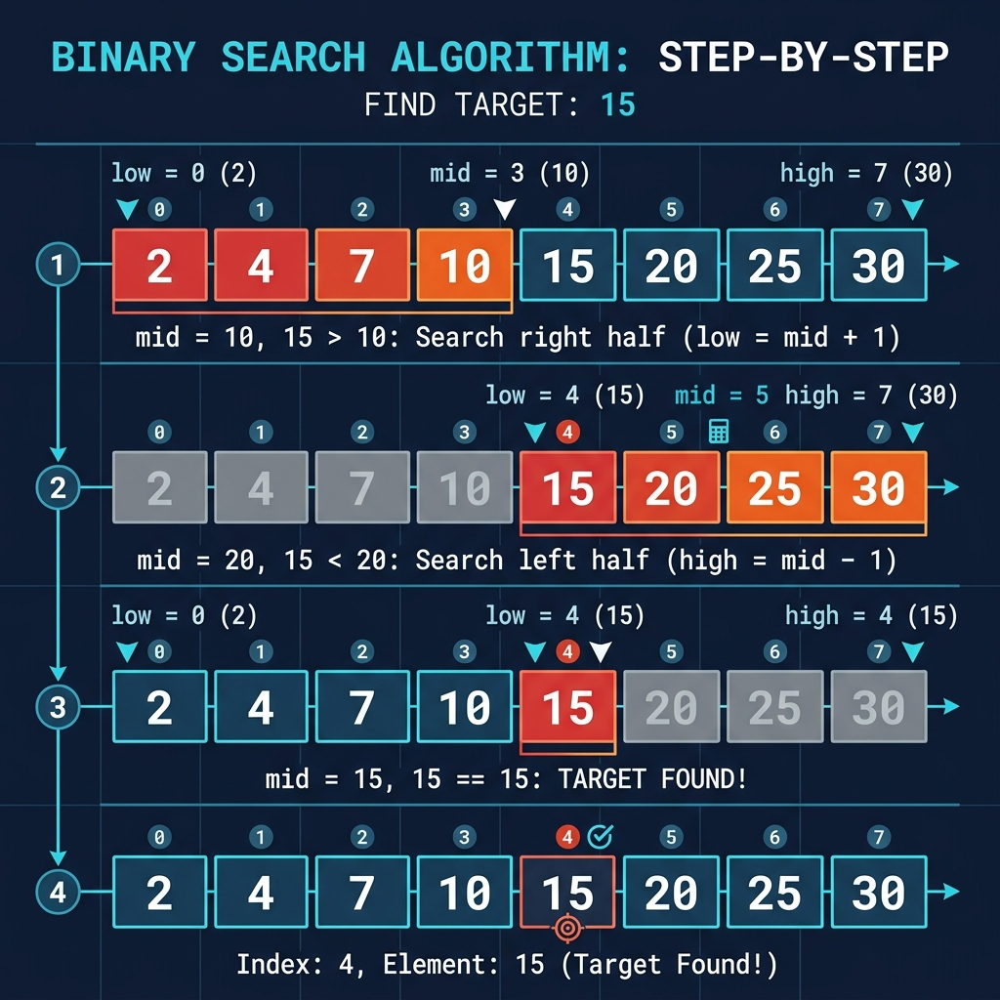

# Chapter 1: Binary Search

<p align="center">
  
</p>

## Introduction

Binary search is one of the most fundamental and elegant algorithms in computer science. Instead of checking every element one by one (linear search), binary search **repeatedly divides the search space in half**, making it exponentially faster.

> **Key Insight** (from *Grokking Algorithms*, Ch. 1): "With binary search, you guess the middle number and eliminate half the remaining numbers every time."

### When to Use Binary Search

- The collection **must be sorted**
- You need to find a specific element or determine its absence
- You want **O(log n)** performance instead of O(n)

### Real-World Applications

- **Dictionary lookups** — finding a word in a physical dictionary
- **Database indexing** — B-tree indices use binary search principles
- **Git bisect** — finding the commit that introduced a bug
- **Version control** — binary searching through API versions for compatibility

---

## How It Works

Binary search maintains two pointers — `low` and `high` — that define the current search range. At each step:

1. Calculate the **middle index**: `mid = (low + high) / 2`
2. Compare the middle element with the target
3. If equal → **found it!**
4. If target is smaller → search the **left half** (`high = mid - 1`)
5. If target is larger → search the **right half** (`low = mid + 1`)
6. Repeat until found or `low > high` (not found)

### Step-by-Step Visual Walkthrough

<p align="center">
  
</p>

### Worked Example

Searching for **15** in the sorted array `[2, 4, 7, 10, 15, 20, 25, 30]`:

| Step | Low | High | Mid | arr[mid] | Action |
|------|-----|------|-----|----------|--------|
| 1 | 0 | 7 | 3 | 10 | 15 > 10 → search right |
| 2 | 4 | 7 | 5 | 20 | 15 < 20 → search left |
| 3 | 4 | 4 | 4 | **15** | ✅ **Found at index 4!** |

Only **3 steps** instead of 5 (linear search would need 5 comparisons).

---

## Complexity Analysis

| Case | Time Complexity | Explanation |
|------|----------------|-------------|
| **Best** | O(1) | Target is at the middle |
| **Average** | O(log n) | Halving the search space each time |
| **Worst** | O(log n) | Target is at the boundary or absent |
| **Space** | O(1) iterative / O(log n) recursive | Stack frames for recursion |

> **From *Introduction to Algorithms* (CLRS):** Binary search is a direct application of the divide-and-conquer paradigm — at each step the problem size is reduced by half, yielding the recurrence T(n) = T(n/2) + Θ(1), which solves to Θ(lg n).

### Comparison with Linear Search

For an array of **1,000,000** elements:
- **Linear search**: up to **1,000,000** comparisons
- **Binary search**: at most **20** comparisons (log₂ 1,000,000 ≈ 20)

---

## Implementations

### Java

```java
public class BinarySearch {

    /**
     * Iterative binary search.
     * @param arr  sorted array of integers
     * @param target  the value to find
     * @return index of target, or -1 if not found
     */
    public static int binarySearch(int[] arr, int target) {
        int low = 0;
        int high = arr.length - 1;

        while (low <= high) {
            int mid = low + (high - low) / 2;  // avoids integer overflow

            if (arr[mid] == target) {
                return mid;
            } else if (arr[mid] < target) {
                low = mid + 1;
            } else {
                high = mid - 1;
            }
        }
        return -1;  // not found
    }

    /**
     * Recursive binary search.
     */
    public static int binarySearchRecursive(int[] arr, int target, int low, int high) {
        if (low > high) return -1;

        int mid = low + (high - low) / 2;

        if (arr[mid] == target) return mid;
        else if (arr[mid] < target) return binarySearchRecursive(arr, target, mid + 1, high);
        else return binarySearchRecursive(arr, target, low, mid - 1);
    }

    public static void main(String[] args) {
        int[] arr = {2, 4, 7, 10, 15, 20, 25, 30};
        int target = 15;

        int result = binarySearch(arr, target);
        System.out.println("Iterative: Found " + target + " at index " + result);

        int resultRec = binarySearchRecursive(arr, target, 0, arr.length - 1);
        System.out.println("Recursive: Found " + target + " at index " + resultRec);
    }
}
```

### Python

```python
def binary_search(arr: list[int], target: int) -> int:
    """Iterative binary search. Returns index or -1 if not found."""
    low, high = 0, len(arr) - 1

    while low <= high:
        mid = (low + high) // 2

        if arr[mid] == target:
            return mid
        elif arr[mid] < target:
            low = mid + 1
        else:
            high = mid - 1

    return -1


def binary_search_recursive(arr: list[int], target: int, low: int, high: int) -> int:
    """Recursive binary search."""
    if low > high:
        return -1

    mid = (low + high) // 2

    if arr[mid] == target:
        return mid
    elif arr[mid] < target:
        return binary_search_recursive(arr, target, mid + 1, high)
    else:
        return binary_search_recursive(arr, target, low, mid - 1)


if __name__ == "__main__":
    arr = [2, 4, 7, 10, 15, 20, 25, 30]
    target = 15

    print(f"Iterative: Found {target} at index {binary_search(arr, target)}")
    print(f"Recursive: Found {target} at index {binary_search_recursive(arr, target, 0, len(arr) - 1)}")
```

### C++

```cpp
#include <iostream>
#include <vector>

/**
 * Iterative binary search.
 * Returns the index of target, or -1 if not found.
 */
int binarySearch(const std::vector<int>& arr, int target) {
    int low = 0;
    int high = static_cast<int>(arr.size()) - 1;

    while (low <= high) {
        int mid = low + (high - low) / 2;

        if (arr[mid] == target)
            return mid;
        else if (arr[mid] < target)
            low = mid + 1;
        else
            high = mid - 1;
    }
    return -1;
}

/**
 * Recursive binary search.
 */
int binarySearchRecursive(const std::vector<int>& arr, int target, int low, int high) {
    if (low > high) return -1;

    int mid = low + (high - low) / 2;

    if (arr[mid] == target) return mid;
    else if (arr[mid] < target) return binarySearchRecursive(arr, target, mid + 1, high);
    else return binarySearchRecursive(arr, target, low, mid - 1);
}

int main() {
    std::vector<int> arr = {2, 4, 7, 10, 15, 20, 25, 30};
    int target = 15;

    int result = binarySearch(arr, target);
    std::cout << "Iterative: Found " << target << " at index " << result << std::endl;

    int resultRec = binarySearchRecursive(arr, target, 0, arr.size() - 1);
    std::cout << "Recursive: Found " << target << " at index " << resultRec << std::endl;

    return 0;
}
```

---

## Key Takeaways

1. **Binary search requires a sorted array** — this is the fundamental prerequisite
2. **O(log n) is dramatically faster than O(n)** — for 1 billion elements, only ~30 steps
3. **Use `low + (high - low) / 2`** instead of `(low + high) / 2` to avoid integer overflow
4. **Both iterative and recursive** forms are common; iterative uses O(1) space

> **Sources**: *Grokking Algorithms* Ch. 1, *Introduction to Algorithms* (CLRS) Ch. 2, *A Common-Sense Guide to Data Structures and Algorithms* Ch. 2

---

| [← Table of Contents](../README.md) | [Next: Selection Sort →](02-selection-sort.md) |
|:-------------------------------------|-----------------------------------------------:|
