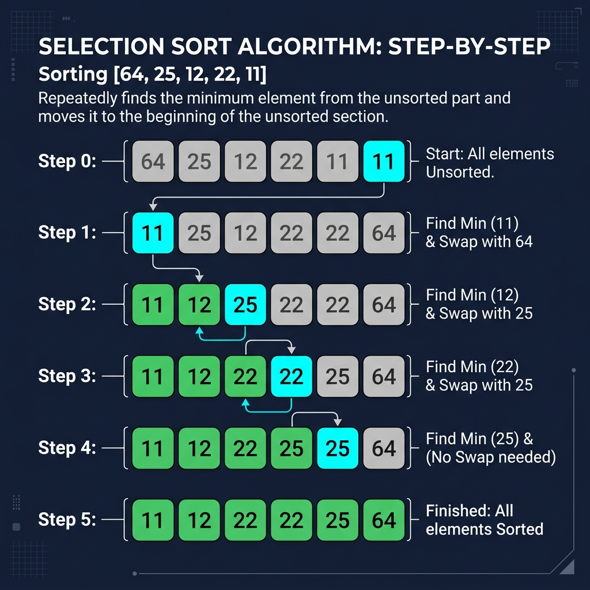

# Chapter 2: Selection Sort

<p align="center">
  
</p>

## Introduction

Selection sort is one of the simplest sorting algorithms to understand. It works by **repeatedly finding the minimum element** from the unsorted portion of the array and placing it at the beginning.

> **Key Insight** (from *Grokking Algorithms*, Ch. 2): "Selection sort is a neat algorithm, but it's not very fast. Each time you find the minimum element, you have to scan the remaining unsorted elements."

### When to Use Selection Sort

- **Small datasets** — simplicity outweighs performance concerns
- **Educational purposes** — great for learning sorting fundamentals
- **Memory-constrained** environments — it sorts in-place with O(1) extra space
- When the **number of swaps matters** — selection sort does at most n-1 swaps

---

## How It Works

1. Find the **minimum** element in the unsorted portion
2. **Swap** it with the first unsorted element
3. Move the boundary of the sorted portion one step right
4. **Repeat** until the entire array is sorted

### Step-by-Step Visual Walkthrough

<p align="center">
  
</p>

### Worked Example

Sorting `[64, 25, 12, 22, 11]`:

| Pass | Array State | Min Found | Swap |
|------|------------|-----------|------|
| 1 | **[64]**, 25, 12, 22, 11 | 11 | swap(64, 11) → [**11**, 25, 12, 22, 64] |
| 2 | 11, **[25]**, 12, 22, 64 | 12 | swap(25, 12) → [11, **12**, 25, 22, 64] |
| 3 | 11, 12, **[25]**, 22, 64 | 22 | swap(25, 22) → [11, 12, **22**, 25, 64] |
| 4 | 11, 12, 22, **[25]**, 64 | 25 | no swap needed |
| ✅ | **[11, 12, 22, 25, 64]** | — | Sorted! |

---

## Mathematical Foundation

Selection sort performs a strictly deterministic number of comparisons regardless of the initial ordering of the array. 

During the $i$-th iteration (where $i$ ranges from $1$ to $n-1$), the algorithm must scan the remaining $n - i$ elements to find the minimum.

The total number of comparisons $C(n)$ forms an arithmetic progression:
$$ C(n) = (n-1) + (n-2) + \dots + 2 + 1 $$

Using the formula for the sum of the first $k$ integers ($S = \frac{k(k+1)}{2}$) where $k = n-1$:
$$ C(n) = \sum_{i=1}^{n-1} i = \frac{(n-1)n}{2} = \frac{n^2 - n}{2} $$

Because the $n^2$ term dominates as $n$ grows, the mathematical time complexity is strictly bounded by:
$$ C(n) = \Theta(n^2) $$

**Swaps:**
Unlike comparisons, the number of swaps is bounded by $O(n)$. Specifically, there is at most $1$ swap per outer loop iteration, leading to exactly $n-1$ swaps in the worst case.

---

## Complexity Analysis

| Case | Time Complexity | Explanation |
|------|----------------|-------------|
| **Best** | O(n²) | Still scans all remaining elements each pass |
| **Average** | O(n²) | n + (n-1) + (n-2) + ... + 1 = n(n-1)/2 |
| **Worst** | O(n²) | Same as average — always does full scans |
| **Space** | O(1) | In-place sorting, only needs a temp variable |

> **From *CLRS*:** Selection sort maintains the loop invariant that the first j elements of the array are sorted and are the j smallest elements overall.

### Number of Operations
- **Comparisons**: n(n-1)/2 (always the same)
- **Swaps**: at most n-1 (one per pass) — **far fewer than bubble sort**

---

## Implementations

### Java

```java
public class SelectionSort {

    public static void selectionSort(int[] arr) {
        int n = arr.length;

        for (int i = 0; i < n - 1; i++) {
            // Find the minimum element in the unsorted portion
            int minIdx = i;
            for (int j = i + 1; j < n; j++) {
                if (arr[j] < arr[minIdx]) {
                    minIdx = j;
                }
            }

            // Swap the found minimum with the first unsorted element
            if (minIdx != i) {
                int temp = arr[i];
                arr[i] = arr[minIdx];
                arr[minIdx] = temp;
            }
        }
    }

    public static void main(String[] args) {
        int[] arr = {64, 25, 12, 22, 11};
        System.out.print("Before: ");
        for (int v : arr) System.out.print(v + " ");

        selectionSort(arr);

        System.out.print("\nAfter:  ");
        for (int v : arr) System.out.print(v + " ");
        System.out.println();
    }
}
```

### Python

```python
def selection_sort(arr: list[int]) -> list[int]:
    """In-place selection sort."""
    n = len(arr)

    for i in range(n - 1):
        # Find the index of the minimum element in arr[i:]
        min_idx = i
        for j in range(i + 1, n):
            if arr[j] < arr[min_idx]:
                min_idx = j

        # Swap the minimum element with the first unsorted element
        if min_idx != i:
            arr[i], arr[min_idx] = arr[min_idx], arr[i]

    return arr


if __name__ == "__main__":
    arr = [64, 25, 12, 22, 11]
    print(f"Before: {arr}")
    selection_sort(arr)
    print(f"After:  {arr}")
```

### C++

```cpp
#include <iostream>
#include <vector>
#include <algorithm>

void selectionSort(std::vector<int>& arr) {
    int n = arr.size();

    for (int i = 0; i < n - 1; i++) {
        // Find the minimum element in the unsorted portion
        int minIdx = i;
        for (int j = i + 1; j < n; j++) {
            if (arr[j] < arr[minIdx]) {
                minIdx = j;
            }
        }

        // Swap the found minimum with the first unsorted element
        if (minIdx != i) {
            std::swap(arr[i], arr[minIdx]);
        }
    }
}

int main() {
    std::vector<int> arr = {64, 25, 12, 22, 11};

    std::cout << "Before: ";
    for (int v : arr) std::cout << v << " ";

    selectionSort(arr);

    std::cout << "\nAfter:  ";
    for (int v : arr) std::cout << v << " ";
    std::cout << std::endl;

    return 0;
}
```

---

## Key Takeaways

1. **Simple but slow** — O(n²) makes it impractical for large datasets
2. **Minimal swaps** — only n-1 swaps maximum, useful when write operations are expensive
3. **Not stable** — equal elements may change relative order (unlike insertion sort)
4. **Always O(n²)** — performance doesn't depend on initial ordering

> **Sources**: *Grokking Algorithms* Ch. 2, *Introduction to Algorithms* (CLRS) Ch. 2, *A Common-Sense Guide* Ch. 5

---

| [← Binary Search](01-binary-search.md) | [Next: Merge Sort →](03-merge-sort.md) |
|:----------------------------------------|----------------------------------------:|
