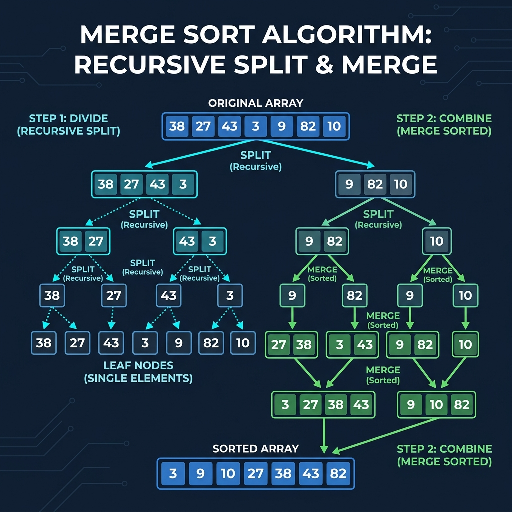

# Chapter 3: Merge Sort

<p align="center">
  
</p>

## Introduction

Merge sort is a **divide-and-conquer** algorithm that splits an array into halves, recursively sorts each half, and then merges the two sorted halves back together. It was invented by John von Neumann in 1945 and remains one of the most efficient general-purpose sorting algorithms.

> **Key Insight** (from *Grokking Algorithms*, Ch. 4): "Merge sort is much faster than selection sort. While selection sort takes O(n²), merge sort takes only O(n log n)."

### When to Use Merge Sort

- When you need **guaranteed O(n log n)** performance (no worst-case degradation)
- When **stability** matters (equal elements keep their relative order)
- For **linked lists** — merge sort is ideal since it doesn't require random access
- In **external sorting** — sorting data that doesn't fit in memory

---

## How It Works

1. **Divide**: Split the array into two halves
2. **Conquer**: Recursively sort each half
3. **Combine**: Merge the two sorted halves into one sorted array

The key operation is the **merge step**: given two sorted arrays, produce one sorted array by repeatedly picking the smaller element from the front of each.

### Step-by-Step Visual Walkthrough

<p align="center">
  
</p>

### Worked Example

Sorting `[38, 27, 43, 3, 9, 82, 10]`:

```
                    [38, 27, 43, 3, 9, 82, 10]
                   /                            \
          [38, 27, 43, 3]                [9, 82, 10]
          /              \               /          \
      [38, 27]       [43, 3]        [9, 82]       [10]
      /      \       /     \        /     \          |
   [38]    [27]   [43]    [3]    [9]    [82]       [10]
      \      /       \     /        \     /          |
      [27, 38]       [3, 43]       [9, 82]        [10]
          \              /               \          /
       [3, 27, 38, 43]              [9, 10, 82]
                   \                     /
           [3, 9, 10, 27, 38, 43, 82]  ✅
```

---

## Mathematical Foundation

Merge Sort's performance is mathematically analyzed through its divide-and-conquer recurrence relation.

The time to sort an array of $n$ elements, $T(n)$, consists of:
1. **Dividing** the array into two halves (constant time, $O(1)$)
2. **Conquering** by recursively sorting the two halves ($2T(n/2)$)
3. **Combining** the two sorted halves (linear time, $\Theta(n)$)

**Recurrence Relation:**
$$ T(n) = 2T(n/2) + \Theta(n) $$

**Recursion Tree Method:**
If we draw the recursion tree, each node at depth $d$ has size $n/2^d$. 
- At depth $d$, there are $2^d$ nodes.
- The merging cost per node is $c(n/2^d)$.
- Total cost at depth $d$: $2^d \times c(n/2^d) = cn$.

The tree stops growing when the subproblem size is $1$, which occurs at depth $d = \log_2 n$.
Since there are $\log_2 n$ levels and each level costs $cn$ work:
$$ T(n) = \sum_{i=0}^{\log_2 n} cn = cn \log_2 n = \Theta(n \log n) $$

This is also formally proven by Case 2 of the **Master Theorem**, as $f(n) = \Theta(n)$ matches $n^{\log_b a} = n^{\log_2 2} = n^1$.

---

## Complexity Analysis

| Case | Time Complexity | Explanation |
|------|----------------|-------------|
| **Best** | O(n log n) | Always divides and merges |
| **Average** | O(n log n) | Consistent performance |
| **Worst** | O(n log n) | No worst-case degradation |
| **Space** | O(n) | Needs auxiliary array for merging |

> **From *CLRS* Ch. 2:** The merge sort recurrence is T(n) = 2T(n/2) + Θ(n). By the Master Theorem, this yields T(n) = Θ(n lg n). The Θ(n) term comes from the merge step, which examines each element exactly once.

### Why O(n log n)?
- **log n levels** of recursion (halving each time)
- **n work** at each level (merging all elements)
- Total: **n × log n** operations

---

## Implementations

### Java

```java
public class MergeSort {

    public static void mergeSort(int[] arr, int left, int right) {
        if (left < right) {
            int mid = left + (right - left) / 2;

            // Sort first and second halves
            mergeSort(arr, left, mid);
            mergeSort(arr, mid + 1, right);

            // Merge the sorted halves
            merge(arr, left, mid, right);
        }
    }

    private static void merge(int[] arr, int left, int mid, int right) {
        // Create temp arrays
        int n1 = mid - left + 1;
        int n2 = right - mid;
        int[] L = new int[n1];
        int[] R = new int[n2];

        System.arraycopy(arr, left, L, 0, n1);
        System.arraycopy(arr, mid + 1, R, 0, n2);

        int i = 0, j = 0, k = left;

        // Merge back into arr
        while (i < n1 && j < n2) {
            if (L[i] <= R[j]) {
                arr[k++] = L[i++];
            } else {
                arr[k++] = R[j++];
            }
        }

        // Copy remaining elements
        while (i < n1) arr[k++] = L[i++];
        while (j < n2) arr[k++] = R[j++];
    }

    public static void main(String[] args) {
        int[] arr = {38, 27, 43, 3, 9, 82, 10};
        System.out.print("Before: ");
        for (int v : arr) System.out.print(v + " ");

        mergeSort(arr, 0, arr.length - 1);

        System.out.print("\nAfter:  ");
        for (int v : arr) System.out.print(v + " ");
        System.out.println();
    }
}
```

### Python

```python
def merge_sort(arr: list[int]) -> list[int]:
    """Recursive merge sort — returns a new sorted list."""
    if len(arr) <= 1:
        return arr

    mid = len(arr) // 2
    left = merge_sort(arr[:mid])
    right = merge_sort(arr[mid:])

    return merge(left, right)


def merge(left: list[int], right: list[int]) -> list[int]:
    """Merge two sorted lists into one sorted list."""
    result = []
    i = j = 0

    while i < len(left) and j < len(right):
        if left[i] <= right[j]:
            result.append(left[i])
            i += 1
        else:
            result.append(right[j])
            j += 1

    result.extend(left[i:])
    result.extend(right[j:])
    return result


if __name__ == "__main__":
    arr = [38, 27, 43, 3, 9, 82, 10]
    print(f"Before: {arr}")
    sorted_arr = merge_sort(arr)
    print(f"After:  {sorted_arr}")
```

### C++

```cpp
#include <iostream>
#include <vector>

void merge(std::vector<int>& arr, int left, int mid, int right) {
    int n1 = mid - left + 1;
    int n2 = right - mid;

    std::vector<int> L(arr.begin() + left, arr.begin() + mid + 1);
    std::vector<int> R(arr.begin() + mid + 1, arr.begin() + right + 1);

    int i = 0, j = 0, k = left;

    while (i < n1 && j < n2) {
        if (L[i] <= R[j])
            arr[k++] = L[i++];
        else
            arr[k++] = R[j++];
    }

    while (i < n1) arr[k++] = L[i++];
    while (j < n2) arr[k++] = R[j++];
}

void mergeSort(std::vector<int>& arr, int left, int right) {
    if (left < right) {
        int mid = left + (right - left) / 2;

        mergeSort(arr, left, mid);
        mergeSort(arr, mid + 1, right);
        merge(arr, left, mid, right);
    }
}

int main() {
    std::vector<int> arr = {38, 27, 43, 3, 9, 82, 10};

    std::cout << "Before: ";
    for (int v : arr) std::cout << v << " ";

    mergeSort(arr, 0, arr.size() - 1);

    std::cout << "\nAfter:  ";
    for (int v : arr) std::cout << v << " ";
    std::cout << std::endl;

    return 0;
}
```

---

## Key Takeaways

1. **Guaranteed O(n log n)** — no worst-case performance degradation unlike quicksort
2. **Stable sort** — preserves relative order of equal elements
3. **O(n) extra space** — the main disadvantage vs. in-place algorithms
4. **Excellent for linked lists** — merge step doesn't require random access
5. **Divide and conquer** paradigm — a cornerstone technique in algorithm design

> **Sources**: *Grokking Algorithms* Ch. 4, *Introduction to Algorithms* (CLRS) Ch. 2, *The Algorithm Design Manual* (Skiena)

---

| [← Selection Sort](02-selection-sort.md) | [Next: Quicksort →](04-quicksort.md) |
|:-----------------------------------------|--------------------------------------:|
