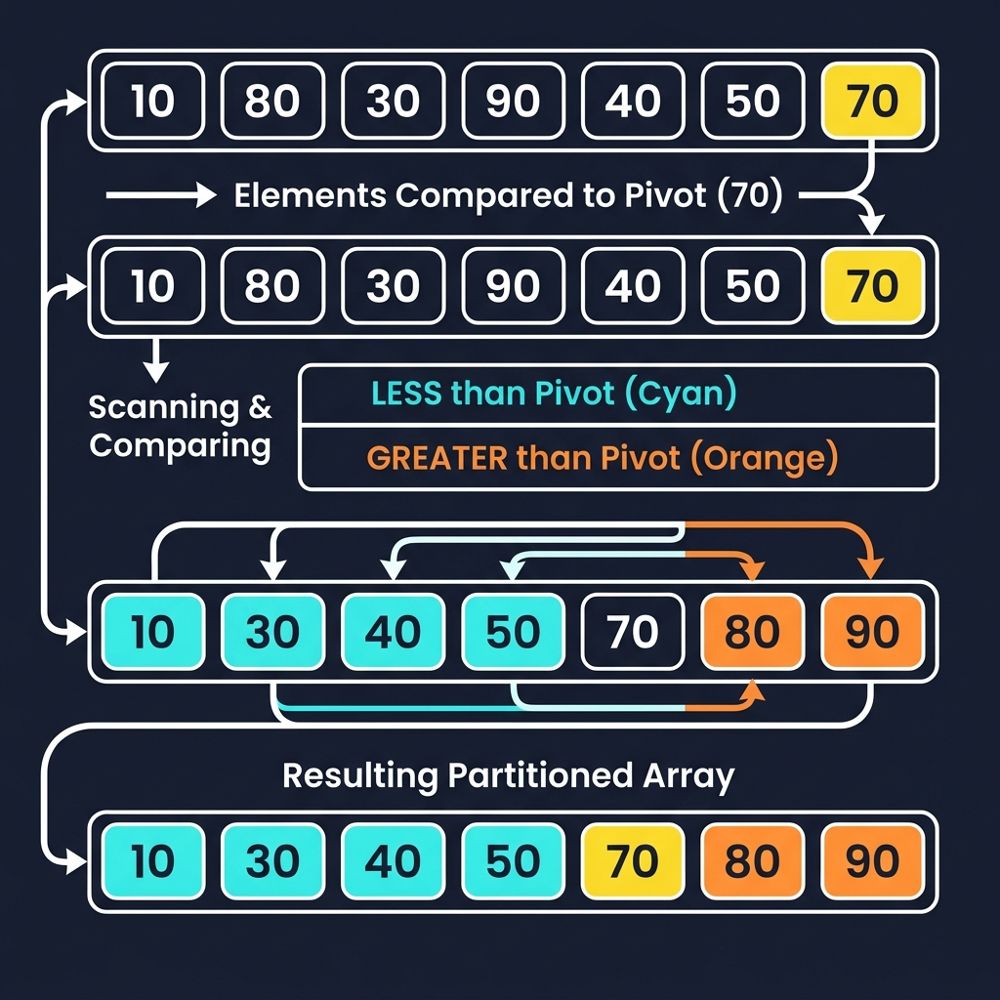

# Chapter 4: Quicksort

<p align="center">
  
</p>

## Introduction

Quicksort is the **fastest general-purpose sorting algorithm in practice**. Developed by Tony Hoare in 1959, it uses a divide-and-conquer strategy based on **partitioning**: choosing a "pivot" element and rearranging the array so that all smaller elements go left and all larger elements go right.

> **Key Insight** (from *Grokking Algorithms*, Ch. 4): "Quicksort is unique because its speed depends on the pivot you choose. In the average case, quicksort takes O(n log n) time."

### When to Use Quicksort

- **General-purpose sorting** — the default in most standard libraries
- When **in-place sorting** is needed (O(log n) extra space for recursion)
- When **average-case performance** matters more than worst-case guarantees
- Arrays (not ideal for linked lists — use merge sort instead)

---

## How It Works

1. **Choose a pivot** element from the array
2. **Partition**: rearrange elements so that:
   - All elements **< pivot** go to the left
   - All elements **> pivot** go to the right
   - The pivot is in its **final sorted position**
3. **Recursively sort** the left and right sub-arrays

### Step-by-Step Visual Walkthrough

<p align="center">
  
</p>

### Worked Example

Sorting `[10, 80, 30, 90, 40, 50, 70]` with pivot = 70:

```
Step 1: Choose pivot = 70 (last element)
Step 2: Partition
        Elements < 70: [10, 30, 40, 50]
        Pivot:          [70]
        Elements > 70:  [80, 90]
        Result: [10, 30, 40, 50, 70, 80, 90]

Step 3: Recursively sort [10, 30, 40, 50] and [80, 90]
        Both sub-arrays are nearly sorted → quick recursion
        
Final:  [10, 30, 40, 50, 70, 80, 90] ✅
```

---

## Mathematical Foundation

Quicksort's mathematical behavior is highly dependent on the pivot selection. We analyze it using recurrence relations and expected values.

**Worst-Case Recurrence:**
If the partition is maximally unbalanced (e.g., partitioning $n$ elements into $n-1$ and $0$ elements), the recurrence is:
$$ T(n) = T(n-1) + T(0) + \Theta(n) $$
Expanding this arithmetic series yields:
$$ T(n) = \sum_{k=1}^n \Theta(k) = \Theta(n^2) $$

**Best-Case Recurrence:**
If the partition splits the array perfectly in half every time:
$$ T(n) = 2T(n/2) + \Theta(n) $$
By the Master Theorem, this results in $T(n) = \Theta(n \log n)$.

**Expected (Average) Case Analysis:**
For a randomly chosen pivot, any element $x_i$ has an equal probability of $1/n$ of being chosen. The expected time $E[T(n)]$ is:
$$ E[T(n)] = \frac{1}{n} \sum_{i=1}^n \left( E[T(i-1)] + E[T(n-i)] \right) + \Theta(n) $$

Through algebraic simplification and continuous approximation via integrals, the expected number of comparisons $C(n)$ can be shown to be closely related to the Harmonic number $H_n$:
$$ C(n) \approx 2n \ln n \approx 1.39n \log_2 n $$
This proves that the average case is tightly bounded by $O(n \log n)$, with a very small hidden constant factor, making it practically faster than Merge Sort.

---

## Complexity Analysis

| Case | Time Complexity | Explanation |
|------|----------------|-------------|
| **Best** | O(n log n) | Pivot always splits evenly |
| **Average** | O(n log n) | Random pivot gives balanced splits |
| **Worst** | O(n²) | Already sorted + bad pivot choice |
| **Space** | O(log n) | Recursion stack depth |

> **From *CLRS* Ch. 7:** "The worst-case running time of quicksort is Θ(n²), which occurs when the partitioning is maximally unbalanced. However, the average-case running time is Θ(n lg n), and quicksort outperforms merge sort in practice due to smaller constant factors."

### Pivot Selection Strategies

| Strategy | Pros | Cons |
|----------|------|------|
| Last element | Simple | O(n²) on sorted input |
| Random element | Avoids worst case | Small overhead |
| Median-of-three | Good balance | Slightly complex |

---

## Implementations

### Java

```java
public class QuickSort {

    public static void quickSort(int[] arr, int low, int high) {
        if (low < high) {
            int pivotIndex = partition(arr, low, high);
            quickSort(arr, low, pivotIndex - 1);
            quickSort(arr, pivotIndex + 1, high);
        }
    }

    private static int partition(int[] arr, int low, int high) {
        int pivot = arr[high];  // choose last element as pivot
        int i = low - 1;       // index of smaller element boundary

        for (int j = low; j < high; j++) {
            if (arr[j] <= pivot) {
                i++;
                // Swap arr[i] and arr[j]
                int temp = arr[i];
                arr[i] = arr[j];
                arr[j] = temp;
            }
        }

        // Place pivot in its correct position
        int temp = arr[i + 1];
        arr[i + 1] = arr[high];
        arr[high] = temp;

        return i + 1;
    }

    public static void main(String[] args) {
        int[] arr = {10, 80, 30, 90, 40, 50, 70};
        System.out.print("Before: ");
        for (int v : arr) System.out.print(v + " ");

        quickSort(arr, 0, arr.length - 1);

        System.out.print("\nAfter:  ");
        for (int v : arr) System.out.print(v + " ");
        System.out.println();
    }
}
```

### Python

```python
def quicksort(arr: list[int]) -> list[int]:
    """Quicksort using list comprehensions (Haskell-style, simple)."""
    if len(arr) <= 1:
        return arr

    pivot = arr[len(arr) // 2]
    left = [x for x in arr if x < pivot]
    middle = [x for x in arr if x == pivot]
    right = [x for x in arr if x > pivot]

    return quicksort(left) + middle + quicksort(right)


def quicksort_inplace(arr: list[int], low: int, high: int) -> None:
    """In-place quicksort using Lomuto partition scheme."""
    if low < high:
        pivot_idx = partition(arr, low, high)
        quicksort_inplace(arr, low, pivot_idx - 1)
        quicksort_inplace(arr, pivot_idx + 1, high)


def partition(arr: list[int], low: int, high: int) -> int:
    """Lomuto partition scheme — pivot is last element."""
    pivot = arr[high]
    i = low - 1

    for j in range(low, high):
        if arr[j] <= pivot:
            i += 1
            arr[i], arr[j] = arr[j], arr[i]

    arr[i + 1], arr[high] = arr[high], arr[i + 1]
    return i + 1


if __name__ == "__main__":
    arr = [10, 80, 30, 90, 40, 50, 70]
    print(f"Before:          {arr}")
    print(f"Functional sort: {quicksort(arr)}")

    quicksort_inplace(arr, 0, len(arr) - 1)
    print(f"In-place sort:   {arr}")
```

### C++

```cpp
#include <iostream>
#include <vector>
#include <algorithm>

int partition(std::vector<int>& arr, int low, int high) {
    int pivot = arr[high];
    int i = low - 1;

    for (int j = low; j < high; j++) {
        if (arr[j] <= pivot) {
            i++;
            std::swap(arr[i], arr[j]);
        }
    }

    std::swap(arr[i + 1], arr[high]);
    return i + 1;
}

void quickSort(std::vector<int>& arr, int low, int high) {
    if (low < high) {
        int pivotIndex = partition(arr, low, high);
        quickSort(arr, low, pivotIndex - 1);
        quickSort(arr, pivotIndex + 1, high);
    }
}

int main() {
    std::vector<int> arr = {10, 80, 30, 90, 40, 50, 70};

    std::cout << "Before: ";
    for (int v : arr) std::cout << v << " ";

    quickSort(arr, 0, arr.size() - 1);

    std::cout << "\nAfter:  ";
    for (int v : arr) std::cout << v << " ";
    std::cout << std::endl;

    return 0;
}
```

---

## Quicksort vs. Merge Sort

| Feature | Quicksort | Merge Sort |
|---------|-----------|------------|
| **Average Time** | O(n log n) | O(n log n) |
| **Worst Time** | O(n²) | O(n log n) |
| **Space** | O(log n) | O(n) |
| **Stable** | ❌ No | ✅ Yes |
| **In-place** | ✅ Yes | ❌ No |
| **Cache-friendly** | ✅ Yes | ❌ Less so |
| **Practice Speed** | 🏆 Faster | Slower |

---

## Key Takeaways

1. **Fastest in practice** — small constant factors and cache efficiency
2. **Pivot choice is critical** — randomized pivot avoids worst-case O(n²)
3. **In-place** — only O(log n) stack space, unlike merge sort's O(n)
4. **Not stable** — equal elements may be reordered
5. **C/C++/Java standard libraries** use quicksort variants (introsort, dual-pivot)

> **Sources**: *Grokking Algorithms* Ch. 4, *Introduction to Algorithms* (CLRS) Ch. 7, *The Algorithm Design Manual* (Skiena)

---

| [← Merge Sort](03-merge-sort.md) | [Next: Breadth-First Search →](05-bfs.md) |
|:----------------------------------|------------------------------------------:|
