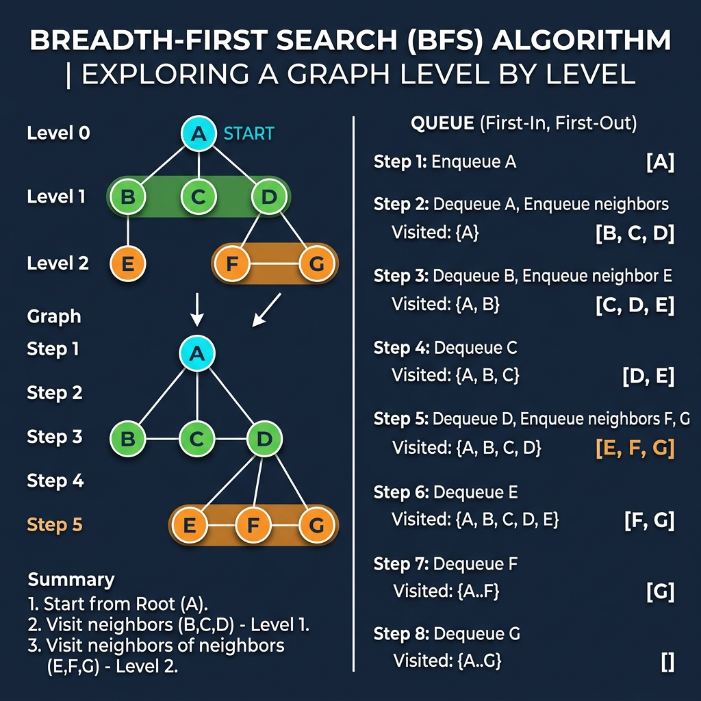

# Chapter 5: Breadth-First Search (BFS)

<p align="center">
  
</p>

## Introduction

Breadth-First Search is a graph traversal algorithm that explores **all neighbors at the current depth** before moving to nodes at the next depth level. It's the go-to algorithm for finding the **shortest path** in unweighted graphs.

> **Key Insight** (from *Grokking Algorithms*, Ch. 6): "Breadth-first search tells you two things: Is there a path from node A to node B? And what is the shortest path from node A to node B?"

### When to Use BFS

- Finding the **shortest path** in an unweighted graph
- **Level-order traversal** of trees
- **Web crawling** — exploring pages breadth-first
- **Social network analysis** — finding degrees of separation
- **Puzzle solving** — finding minimum moves (e.g., Rubik's cube)

---

## How It Works

BFS uses a **queue** (FIFO — First In, First Out):

1. Start at the source node, add it to the queue and mark as visited
2. **Dequeue** the front node
3. Process it and **enqueue all unvisited neighbors**
4. Mark them as visited
5. **Repeat** until the queue is empty

### Step-by-Step Visual Walkthrough

<p align="center">
  
</p>

### Worked Example

Graph adjacency list:
```
A → [B, C, D]
B → [E]
C → []
D → [F, G]
```

| Step | Dequeue | Queue After | Visited |
|------|---------|-------------|---------|
| 1 | — | [A] | {A} |
| 2 | A | [B, C, D] | {A, B, C, D} |
| 3 | B | [C, D, E] | {A, B, C, D, E} |
| 4 | C | [D, E] | {A, B, C, D, E} |
| 5 | D | [E, F, G] | {A, B, C, D, E, F, G} |
| 6 | E | [F, G] | {A, B, C, D, E, F, G} |
| 7 | F | [G] | — |
| 8 | G | [] | ✅ All visited |

**Visit order**: A → B → C → D → E → F → G

---

## Mathematical Foundation

Breadth-First Search systematically explores the edges of a graph $G = (V, E)$ to discover every vertex that is reachable from a source vertex $s$.

**Shortest Path Property:**
BFS computes the shortest path distance (measured in number of edges) from the source vertex $s$ to each reachable vertex. Let $\delta(s, v)$ denote the shortest path distance. 
The algorithm ensures the following invariant: if a vertex $v$ is discovered by traversing an edge from vertex $u$, then:
$$ d(s, v) \le d(s, u) + 1 $$

Since BFS visits vertices layer by layer, it partitions the vertex set into subsets $L_0, L_1, \dots, L_k$ where:
$$ L_i = \{ v \in V \mid \delta(s, v) = i \} $$

This guarantees that when a vertex is dequeued, it has been reached via the shortest possible unweighted path.

---

## Complexity Analysis

| Metric | Complexity | Explanation |
|--------|-----------|-------------|
| **Time** | O(V + E) | Visit every vertex and edge once |
| **Space** | O(V) | Queue + visited set |

Where **V** = number of vertices, **E** = number of edges.

> **From *CLRS* Ch. 22:** "BFS computes the shortest-path distance to each reachable vertex in a graph G = (V, E). It runs in O(V + E) time."

---

## Implementations

### Java

```java
import java.util.*;

public class BFS {

    public static List<String> bfs(Map<String, List<String>> graph, String start) {
        List<String> visited = new ArrayList<>();
        Queue<String> queue = new LinkedList<>();
        Set<String> seen = new HashSet<>();

        queue.add(start);
        seen.add(start);

        while (!queue.isEmpty()) {
            String node = queue.poll();
            visited.add(node);

            for (String neighbor : graph.getOrDefault(node, List.of())) {
                if (!seen.contains(neighbor)) {
                    seen.add(neighbor);
                    queue.add(neighbor);
                }
            }
        }
        return visited;
    }

    /**
     * Find shortest path from start to target using BFS.
     */
    public static List<String> shortestPath(Map<String, List<String>> graph,
                                             String start, String target) {
        Queue<List<String>> queue = new LinkedList<>();
        Set<String> visited = new HashSet<>();

        queue.add(List.of(start));
        visited.add(start);

        while (!queue.isEmpty()) {
            List<String> path = queue.poll();
            String node = path.get(path.size() - 1);

            if (node.equals(target)) return path;

            for (String neighbor : graph.getOrDefault(node, List.of())) {
                if (!visited.contains(neighbor)) {
                    visited.add(neighbor);
                    List<String> newPath = new ArrayList<>(path);
                    newPath.add(neighbor);
                    queue.add(newPath);
                }
            }
        }
        return List.of();  // no path found
    }

    public static void main(String[] args) {
        Map<String, List<String>> graph = Map.of(
            "A", List.of("B", "C", "D"),
            "B", List.of("E"),
            "C", List.of(),
            "D", List.of("F", "G"),
            "E", List.of(),
            "F", List.of(),
            "G", List.of()
        );

        System.out.println("BFS traversal: " + bfs(graph, "A"));
        System.out.println("Shortest path A→G: " + shortestPath(graph, "A", "G"));
    }
}
```

### Python

```python
from collections import deque


def bfs(graph: dict[str, list[str]], start: str) -> list[str]:
    """BFS traversal returning visit order."""
    visited = []
    queue = deque([start])
    seen = {start}

    while queue:
        node = queue.popleft()
        visited.append(node)

        for neighbor in graph.get(node, []):
            if neighbor not in seen:
                seen.add(neighbor)
                queue.append(neighbor)

    return visited


def shortest_path(graph: dict[str, list[str]], start: str, target: str) -> list[str]:
    """Find shortest path from start to target using BFS."""
    queue = deque([[start]])
    visited = {start}

    while queue:
        path = queue.popleft()
        node = path[-1]

        if node == target:
            return path

        for neighbor in graph.get(node, []):
            if neighbor not in visited:
                visited.add(neighbor)
                queue.append(path + [neighbor])

    return []  # no path found


if __name__ == "__main__":
    graph = {
        "A": ["B", "C", "D"],
        "B": ["E"],
        "C": [],
        "D": ["F", "G"],
        "E": [],
        "F": [],
        "G": [],
    }

    print(f"BFS traversal: {bfs(graph, 'A')}")
    print(f"Shortest path A→G: {shortest_path(graph, 'A', 'G')}")
```

### C++

```cpp
#include <iostream>
#include <vector>
#include <queue>
#include <unordered_map>
#include <unordered_set>
#include <string>

using Graph = std::unordered_map<std::string, std::vector<std::string>>;

std::vector<std::string> bfs(const Graph& graph, const std::string& start) {
    std::vector<std::string> visited;
    std::queue<std::string> q;
    std::unordered_set<std::string> seen;

    q.push(start);
    seen.insert(start);

    while (!q.empty()) {
        std::string node = q.front();
        q.pop();
        visited.push_back(node);

        if (graph.count(node)) {
            for (const auto& neighbor : graph.at(node)) {
                if (seen.find(neighbor) == seen.end()) {
                    seen.insert(neighbor);
                    q.push(neighbor);
                }
            }
        }
    }
    return visited;
}

int main() {
    Graph graph = {
        {"A", {"B", "C", "D"}},
        {"B", {"E"}},
        {"C", {}},
        {"D", {"F", "G"}},
        {"E", {}},
        {"F", {}},
        {"G", {}}
    };

    std::cout << "BFS traversal: ";
    for (const auto& node : bfs(graph, "A")) {
        std::cout << node << " ";
    }
    std::cout << std::endl;

    return 0;
}
```

---

## Key Takeaways

1. **Uses a queue** — FIFO order ensures level-by-level exploration
2. **Shortest path** in unweighted graphs — guaranteed by level-order visit
3. **O(V + E) time** — linear in graph size, very efficient
4. **Mark visited before enqueuing** — prevents infinite loops in cyclic graphs
5. **Contrast with DFS** — BFS goes wide first, DFS goes deep first

> **Sources**: *Grokking Algorithms* Ch. 6, *Introduction to Algorithms* (CLRS) Ch. 22, *The Algorithm Design Manual* (Skiena)

---

| [← Quicksort](04-quicksort.md) | [Next: Dijkstra's Algorithm →](06-dijkstra.md) |
|:--------------------------------|------------------------------------------------:|
