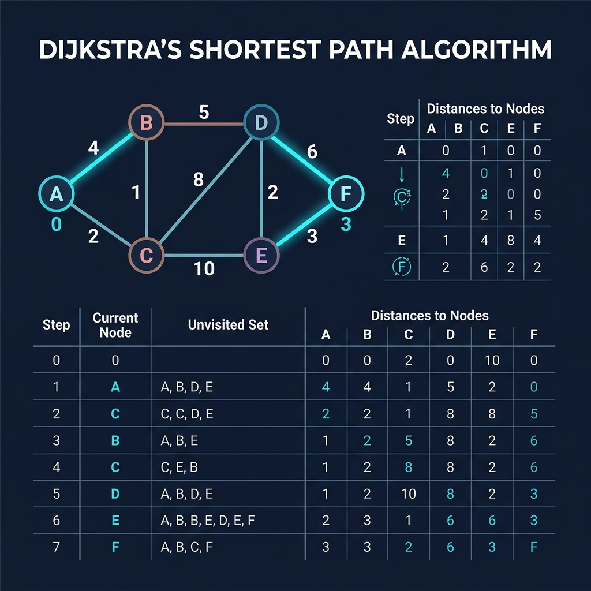

# Chapter 6: Dijkstra's Algorithm

<p align="center">
  
</p>

## Introduction

Dijkstra's algorithm finds the **shortest path** in a weighted graph with **non-negative edge weights**. Published by Edsger W. Dijkstra in 1956, it powers GPS navigation and network routing.

> **Key Insight** (from *Grokking Algorithms*, Ch. 7): "BFS finds the path with the fewest segments; Dijkstra's finds the path with the smallest total weight."

### When to Use
- Shortest paths in **weighted graphs with non-negative weights**
- **GPS / navigation**, **network routing** (OSPF), **game AI pathfinding**

### When NOT to Use
- **Negative edge weights** → use Bellman-Ford
- **Unweighted graphs** → BFS is simpler

---

## How It Works

1. Set distance to source = 0, all others = ∞
2. Use a **priority queue** (min-heap)
3. Extract node with smallest distance
4. For each neighbor: if `dist[current] + weight < dist[neighbor]`, update
5. Repeat until all nodes processed

### Visual Walkthrough

<p align="center">
  
</p>

---

## Mathematical Foundation

Dijkstra's algorithm relies on the principle of **edge relaxation** to find the shortest path in a weighted graph $G = (V, E)$ with a weight function $w: E \to \mathbb{R}^{\ge 0}$.

Let $d(v)$ be the current upper bound on the weight of the shortest path from the source $s$ to $v$. Initially, $d(s) = 0$ and $d(v) = \infty$ for all other vertices.

**Edge Relaxation:**
When evaluating an edge $(u, v)$, the algorithm checks if the path to $v$ can be shortened by going through $u$:
$$ \text{if } d(v) > d(u) + w(u, v) \text{ then } d(v) = d(u) + w(u, v) $$

**Correctness Proof (Triangle Inequality):**
The algorithm maintains a set $S$ of vertices whose final shortest-path weights from $s$ have been determined. At each step, it selects the vertex $u \in V - S$ with the minimum shortest-path estimate $d(u)$.
Because edge weights are strictly non-negative ($w(u, v) \ge 0$), no shorter path to $u$ can be found later by traveling through other unvisited vertices. 
Therefore, when $u$ is added to $S$:
$$ d(u) = \delta(s, u) $$
Where $\delta(s, u)$ is the true minimum theoretical distance.

---

## Complexity Analysis

| Implementation | Time | Space |
|---------------|------|-------|
| **Array** | O(V²) | O(V) |
| **Binary heap** | O((V+E) log V) | O(V) |
| **Fibonacci heap** | O(E + V log V) | O(V) |

---

## Implementations

### Java

```java
import java.util.*;

public class Dijkstra {
    public static Map<String, Integer> dijkstra(
            Map<String, Map<String, Integer>> graph, String start) {
        Map<String, Integer> dist = new HashMap<>();
        PriorityQueue<String> pq = new PriorityQueue<>(
            Comparator.comparingInt(n -> dist.getOrDefault(n, Integer.MAX_VALUE)));
        Set<String> visited = new HashSet<>();

        for (String node : graph.keySet()) dist.put(node, Integer.MAX_VALUE);
        dist.put(start, 0);
        pq.add(start);

        while (!pq.isEmpty()) {
            String current = pq.poll();
            if (visited.contains(current)) continue;
            visited.add(current);

            for (var edge : graph.getOrDefault(current, Map.of()).entrySet()) {
                int newDist = dist.get(current) + edge.getValue();
                if (newDist < dist.getOrDefault(edge.getKey(), Integer.MAX_VALUE)) {
                    dist.put(edge.getKey(), newDist);
                    pq.add(edge.getKey());
                }
            }
        }
        return dist;
    }

    public static void main(String[] args) {
        var graph = Map.of(
            "A", Map.of("B", 4, "C", 2), "B", Map.of("D", 5),
            "C", Map.of("B", 1, "D", 8), "D", Map.of("F", 3),
            "F", Map.<String,Integer>of());
        dijkstra(graph, "A").forEach((n, d) ->
            System.out.println("A → " + n + " = " + d));
    }
}
```

### Python

```python
import heapq

def dijkstra(graph: dict[str, dict[str, int]], start: str) -> dict[str, int]:
    dist = {node: float('inf') for node in graph}
    dist[start] = 0
    pq = [(0, start)]
    visited = set()

    while pq:
        current_dist, current = heapq.heappop(pq)
        if current in visited:
            continue
        visited.add(current)

        for neighbor, weight in graph[current].items():
            new_dist = current_dist + weight
            if new_dist < dist.get(neighbor, float('inf')):
                dist[neighbor] = new_dist
                heapq.heappush(pq, (new_dist, neighbor))
    return dist

if __name__ == "__main__":
    graph = {"A": {"B": 4, "C": 2}, "B": {"D": 5},
             "C": {"B": 1, "D": 8}, "D": {"F": 3}, "F": {}}
    for node, d in sorted(dijkstra(graph, "A").items()):
        print(f"A → {node} = {d}")
```

### C++

```cpp
#include <iostream>
#include <queue>
#include <unordered_map>
#include <unordered_set>
#include <vector>
#include <climits>
#include <string>

using Graph = std::unordered_map<std::string, std::unordered_map<std::string, int>>;

std::unordered_map<std::string, int> dijkstra(const Graph& graph, const std::string& start) {
    std::unordered_map<std::string, int> dist;
    for (const auto& [node, _] : graph) dist[node] = INT_MAX;
    dist[start] = 0;

    using PII = std::pair<int, std::string>;
    std::priority_queue<PII, std::vector<PII>, std::greater<PII>> pq;
    pq.push({0, start});
    std::unordered_set<std::string> visited;

    while (!pq.empty()) {
        auto [d, current] = pq.top(); pq.pop();
        if (visited.count(current)) continue;
        visited.insert(current);
        if (graph.count(current))
            for (const auto& [nb, w] : graph.at(current)) {
                int nd = d + w;
                if (nd < dist[nb]) { dist[nb] = nd; pq.push({nd, nb}); }
            }
    }
    return dist;
}

int main() {
    Graph graph = {{"A",{{"B",4},{"C",2}}},{"B",{{"D",5}}},
                   {"C",{{"B",1},{"D",8}}},{"D",{{"F",3}}},{"F",{}}};
    for (const auto& [n, d] : dijkstra(graph, "A"))
        std::cout << "A -> " << n << " = " << d << std::endl;
}
```

---

## Key Takeaways

1. **Greedy algorithm** — always processes the closest unvisited node
2. **Non-negative weights only** — negative edges break the greedy property
3. **Priority queue is essential** — use min-heap for efficiency
4. **BFS for unweighted, Dijkstra for weighted**

> **Sources**: *Grokking Algorithms* Ch. 7, *CLRS* Ch. 24, *The Algorithm Design Manual*

---

| [← BFS](05-bfs.md) | [Next: Dynamic Programming →](07-dynamic-programming.md) |
|:---------------------|----------------------------------------------------------:|
