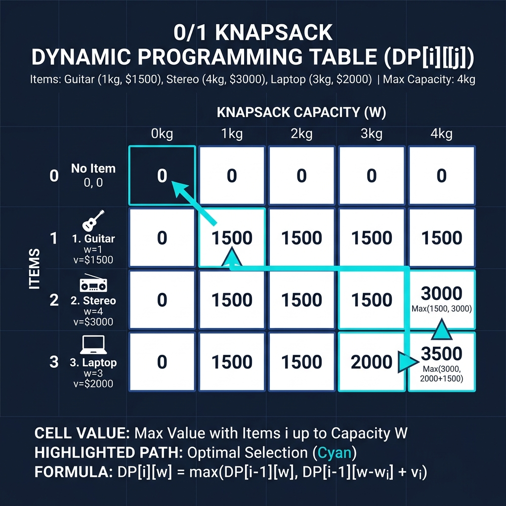

# Chapter 7: Dynamic Programming (Knapsack Problem)

<p align="center">
  
</p>

## Introduction

Dynamic programming (DP) solves complex problems by **breaking them into overlapping subproblems** and storing their solutions to avoid redundant computation. The classic example is the **0/1 Knapsack Problem**: given items with weights and values, maximize the total value that fits within a weight capacity.

> **Key Insight** (from *Grokking Algorithms*, Ch. 9): "Dynamic programming is useful when you're trying to optimize something given a constraint. Every dynamic-programming solution involves a grid."

### When to Use Dynamic Programming

- Problems with **optimal substructure** — optimal solution is built from optimal sub-solutions
- Problems with **overlapping subproblems** — same subproblem solved multiple times
- **Optimization problems** — maximize/minimize some value under constraints
- Examples: Knapsack, longest common subsequence, edit distance, coin change

---

## How It Works (0/1 Knapsack)

Given **n** items, each with weight `w[i]` and value `v[i]`, and a knapsack capacity **W**:

1. Create a 2D table `dp[i][w]` where `i` = items considered, `w` = capacity
2. For each item and each capacity:
   - **Don't take item**: `dp[i][w] = dp[i-1][w]`
   - **Take item** (if it fits): `dp[i][w] = v[i] + dp[i-1][w - w[i]]`
   - Choose the **maximum** of both options
3. `dp[n][W]` contains the answer

### Recurrence Relation

```
dp[i][w] = max(dp[i-1][w], v[i] + dp[i-1][w - w[i]])   if w[i] <= w
dp[i][w] = dp[i-1][w]                                    if w[i] > w
```

### Visual Walkthrough

<p align="center">
  
</p>

### Worked Example

Items: Guitar (1kg, $1500), Stereo (4kg, $3000), Laptop (3kg, $2000). Capacity: 4kg.

**Answer**: Guitar + Laptop = $3500 (total weight: 4kg) ✅

---

## Mathematical Foundation

Dynamic Programming relies on the mathematical principle of **optimal substructure**—an optimal solution to a problem contains optimal solutions to its subproblems.

For the 0/1 Knapsack problem, let $dp[i][w]$ represent the maximum value that can be obtained using a subset of the first $i$ items, with a maximum weight capacity of $w$.

Let the items be defined by their weights $w_i$ and values $v_i$.

**Bellman Equation / Recurrence Relation:**
The state transition can be mathematically defined as:

$$
dp[i][w] = \begin{cases}
dp[i-1][w] & \text{if } w_i > w \\
\max(dp[i-1][w], v_i + dp[i-1][w-w_i]) & \text{if } w_i \le w
\end{cases}
$$

1. **Case 1 ($w_i > w$):** The $i$-th item is heavier than the current capacity $w$, so it cannot be included. The maximum value remains the same as without the item.
2. **Case 2 ($w_i \le w$):** We must choose the maximum between:
   - Not including the $i$-th item: $dp[i-1][w]$
   - Including the $i$-th item: The item's value $v_i$ plus the optimal solution for the remaining capacity $dp[i-1][w-w_i]$.

---

## Complexity Analysis

| Metric | Complexity | Explanation |
|--------|-----------|-------------|
| **Time** | O(n × W) | Fill every cell in the table |
| **Space** | O(n × W) | 2D table (can be optimized to O(W)) |

> **From *CLRS*:** "The 0-1 knapsack problem is NP-hard in general, but the dynamic programming solution is pseudo-polynomial — polynomial in n and W but exponential in the number of bits needed to represent W."

---

## Implementations

### Java

```java
public class Knapsack {

    public static int knapsack(int[] weights, int[] values, int capacity) {
        int n = weights.length;
        int[][] dp = new int[n + 1][capacity + 1];

        for (int i = 1; i <= n; i++) {
            for (int w = 0; w <= capacity; w++) {
                dp[i][w] = dp[i - 1][w];  // don't take item i
                if (weights[i - 1] <= w) {
                    dp[i][w] = Math.max(dp[i][w],
                        values[i - 1] + dp[i - 1][w - weights[i - 1]]);
                }
            }
        }
        return dp[n][capacity];
    }

    public static void main(String[] args) {
        int[] weights = {1, 4, 3};
        int[] values  = {1500, 3000, 2000};
        int capacity  = 4;

        System.out.println("Max value: $" + knapsack(weights, values, capacity));
    }
}
```

### Python

```python
def knapsack(weights: list[int], values: list[int], capacity: int) -> int:
    """0/1 Knapsack using dynamic programming."""
    n = len(weights)
    dp = [[0] * (capacity + 1) for _ in range(n + 1)]

    for i in range(1, n + 1):
        for w in range(capacity + 1):
            dp[i][w] = dp[i - 1][w]  # don't take item i
            if weights[i - 1] <= w:
                dp[i][w] = max(dp[i][w],
                               values[i - 1] + dp[i - 1][w - weights[i - 1]])

    return dp[n][capacity]


def knapsack_with_items(weights, values, capacity):
    """Returns max value and which items to take."""
    n = len(weights)
    dp = [[0] * (capacity + 1) for _ in range(n + 1)]

    for i in range(1, n + 1):
        for w in range(capacity + 1):
            dp[i][w] = dp[i - 1][w]
            if weights[i - 1] <= w:
                dp[i][w] = max(dp[i][w],
                               values[i - 1] + dp[i - 1][w - weights[i - 1]])

    # Backtrack to find selected items
    items = []
    w = capacity
    for i in range(n, 0, -1):
        if dp[i][w] != dp[i - 1][w]:
            items.append(i - 1)
            w -= weights[i - 1]

    return dp[n][capacity], items


if __name__ == "__main__":
    weights = [1, 4, 3]
    values  = [1500, 3000, 2000]
    names   = ["Guitar", "Stereo", "Laptop"]
    capacity = 4

    max_val, selected = knapsack_with_items(weights, values, capacity)
    print(f"Max value: ${max_val}")
    print(f"Items: {[names[i] for i in selected]}")
```

### C++

```cpp
#include <iostream>
#include <vector>
#include <algorithm>

int knapsack(const std::vector<int>& weights,
             const std::vector<int>& values, int capacity) {
    int n = weights.size();
    std::vector<std::vector<int>> dp(n + 1, std::vector<int>(capacity + 1, 0));

    for (int i = 1; i <= n; i++) {
        for (int w = 0; w <= capacity; w++) {
            dp[i][w] = dp[i - 1][w];
            if (weights[i - 1] <= w) {
                dp[i][w] = std::max(dp[i][w],
                    values[i - 1] + dp[i - 1][w - weights[i - 1]]);
            }
        }
    }
    return dp[n][capacity];
}

int main() {
    std::vector<int> weights = {1, 4, 3};
    std::vector<int> values  = {1500, 3000, 2000};
    int capacity = 4;

    std::cout << "Max value: $" << knapsack(weights, values, capacity) << std::endl;
    return 0;
}
```

---

## Key Takeaways

1. **Build solutions bottom-up** — solve smaller subproblems first
2. **The grid/table is the key** — rows = items, columns = capacities
3. **Pseudo-polynomial** — efficient for reasonable W, but not truly polynomial
4. **Space optimization** — can use 1D array since each row only depends on the previous
5. **Applies broadly** — coin change, LCS, edit distance, rod cutting all use DP

> **Sources**: *Grokking Algorithms* Ch. 9, *CLRS* Ch. 15-16, *The Algorithm Design Manual*

---

| [← Dijkstra](06-dijkstra.md) | [Next: Hash Tables →](08-hash-tables.md) |
|:------------------------------|------------------------------------------:|
