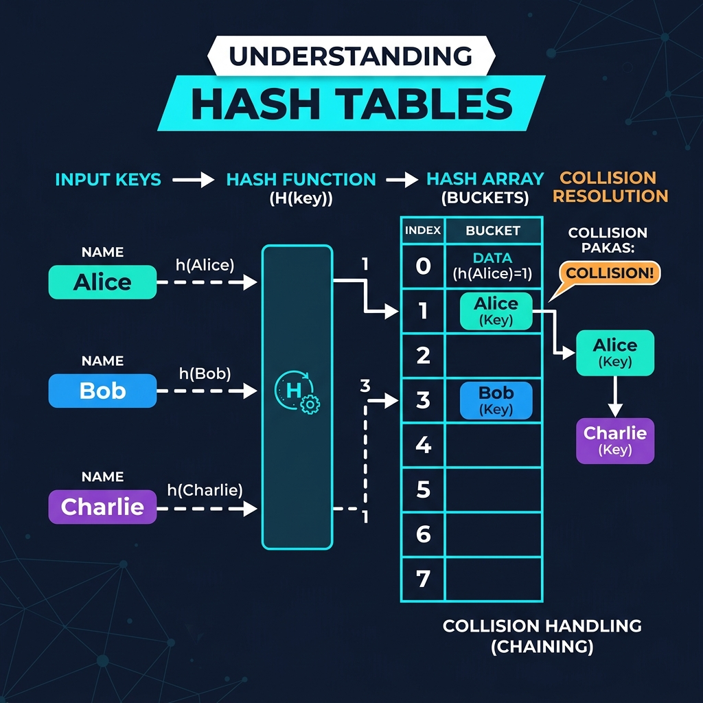

# Chapter 8: Hash Tables

<p align="center">
  
</p>

## Introduction

A hash table (also called hash map or dictionary) is a data structure that maps **keys to values** using a **hash function** for near-instant lookups. It's arguably the most important data structure in practical programming.

> **Key Insight** (from *Grokking Algorithms*, Ch. 5): "Hash tables are a powerful data structure with O(1) average-case lookups, inserts, and deletes. They combine a hash function with an array."

### When to Use Hash Tables

- **Lookups by key** — dictionaries, caches, symbol tables
- **Counting frequencies** — word counts, character frequencies
- **Detecting duplicates** — seen-before checks in O(1)
- **Caching/Memoization** — store computed results

---

## How It Works

1. A **hash function** converts a key into an array index
2. The value is stored at that index in the underlying array
3. On **collision** (two keys map to same index), use chaining or open addressing

### Visual Walkthrough

<p align="center">
  
</p>

### Collision Resolution

| Strategy | How It Works | Pros | Cons |
|----------|-------------|------|------|
| **Chaining** | Each bucket holds a linked list | Simple, handles many collisions | Extra memory for links |
| **Open Addressing** | Probe for next empty slot | Better cache performance | Clustering issues |
| **Robin Hood** | Steal from rich slots | Reduces variance | More complex |

---

## Mathematical Foundation

The performance of a Hash Table mathematically depends on its **load factor** ($\alpha$) and the properties of its hash function.

Let $n$ be the number of keys stored, and $m$ be the number of available slots (buckets).
The load factor is defined as:
$$ \alpha = \frac{n}{m} $$

**Universal Hashing and Collision Probability:**
A good hash function $h(k)$ distributes keys uniformly across the $m$ slots. Under the assumption of simple uniform hashing, any key is equally likely to hash into any of the $m$ slots, independently of other keys.
The probability of a collision between two distinct keys $k_1$ and $k_2$ is:
$$ \Pr[h(k_1) = h(k_2)] = \frac{1}{m} $$

**Expected Chain Length:**
If collisions are resolved using chaining (linked lists), the expected length of a chain at any given slot is equal to the load factor $\alpha$.
Therefore, an unsuccessful search takes expected time:
$$ \Theta(1 + \alpha) $$
Where the $1$ accounts for calculating the hash, and $\alpha$ accounts for traversing the chain. If $m$ is kept proportional to $n$ (so $\alpha \approx 1$), all operations run in $O(1)$ expected time.

---

## Complexity Analysis

| Operation | Average | Worst Case |
|-----------|---------|------------|
| **Search** | O(1) | O(n) |
| **Insert** | O(1) | O(n) |
| **Delete** | O(1) | O(n) |
| **Space** | O(n) | O(n) |

Worst case O(n) happens only with terrible hash function or extreme load factor.

> **From *CLRS* Ch. 11:** "Under the assumption of simple uniform hashing, a search in a hash table takes Θ(1 + α) expected time, where α = n/m is the load factor."

---

## Implementations

### Java

```java
import java.util.*;

public class HashTableDemo {

    /**
     * Simple hash table implementation using chaining.
     */
    static class SimpleHashTable<K, V> {
        private static final int INITIAL_CAPACITY = 16;
        private LinkedList<Entry<K, V>>[] buckets;
        private int size;

        static class Entry<K, V> {
            K key; V value;
            Entry(K key, V value) { this.key = key; this.value = value; }
        }

        @SuppressWarnings("unchecked")
        public SimpleHashTable() {
            buckets = new LinkedList[INITIAL_CAPACITY];
            for (int i = 0; i < INITIAL_CAPACITY; i++)
                buckets[i] = new LinkedList<>();
        }

        private int getBucket(K key) {
            return Math.abs(key.hashCode()) % buckets.length;
        }

        public void put(K key, V value) {
            int idx = getBucket(key);
            for (Entry<K, V> entry : buckets[idx]) {
                if (entry.key.equals(key)) { entry.value = value; return; }
            }
            buckets[idx].add(new Entry<>(key, value));
            size++;
        }

        public V get(K key) {
            int idx = getBucket(key);
            for (Entry<K, V> entry : buckets[idx]) {
                if (entry.key.equals(key)) return entry.value;
            }
            return null;
        }

        public int size() { return size; }
    }

    public static void main(String[] args) {
        SimpleHashTable<String, Integer> table = new SimpleHashTable<>();
        table.put("Alice", 95);
        table.put("Bob", 87);
        table.put("Charlie", 92);

        System.out.println("Alice's score: " + table.get("Alice"));
        System.out.println("Bob's score: " + table.get("Bob"));
        System.out.println("Size: " + table.size());
    }
}
```

### Python

```python
class SimpleHashTable:
    """Hash table with chaining for collision resolution."""

    def __init__(self, capacity: int = 16):
        self.capacity = capacity
        self.buckets: list[list[tuple]] = [[] for _ in range(capacity)]
        self.size = 0

    def _hash(self, key) -> int:
        return hash(key) % self.capacity

    def put(self, key, value):
        idx = self._hash(key)
        for i, (k, v) in enumerate(self.buckets[idx]):
            if k == key:
                self.buckets[idx][i] = (key, value)
                return
        self.buckets[idx].append((key, value))
        self.size += 1

    def get(self, key, default=None):
        idx = self._hash(key)
        for k, v in self.buckets[idx]:
            if k == key:
                return v
        return default

    def __contains__(self, key) -> bool:
        return self.get(key) is not None

    def __len__(self) -> int:
        return self.size


if __name__ == "__main__":
    table = SimpleHashTable()
    table.put("Alice", 95)
    table.put("Bob", 87)
    table.put("Charlie", 92)

    print(f"Alice's score: {table.get('Alice')}")
    print(f"Bob's score: {table.get('Bob')}")
    print(f"Contains Charlie: {'Charlie' in table}")
    print(f"Size: {len(table)}")

    # Python's built-in dict IS a hash table:
    scores = {"Alice": 95, "Bob": 87, "Charlie": 92}
    print(f"\nBuilt-in dict lookup: {scores['Alice']}")
```

### C++

```cpp
#include <iostream>
#include <list>
#include <vector>
#include <string>
#include <functional>

template<typename K, typename V>
class SimpleHashTable {
    struct Entry { K key; V value; };
    std::vector<std::list<Entry>> buckets;
    size_t count = 0;
    static const size_t INITIAL_CAPACITY = 16;

    size_t getBucket(const K& key) const {
        return std::hash<K>{}(key) % buckets.size();
    }

public:
    SimpleHashTable() : buckets(INITIAL_CAPACITY) {}

    void put(const K& key, const V& value) {
        size_t idx = getBucket(key);
        for (auto& entry : buckets[idx]) {
            if (entry.key == key) { entry.value = value; return; }
        }
        buckets[idx].push_back({key, value});
        count++;
    }

    V* get(const K& key) {
        size_t idx = getBucket(key);
        for (auto& entry : buckets[idx]) {
            if (entry.key == key) return &entry.value;
        }
        return nullptr;
    }

    size_t size() const { return count; }
};

int main() {
    SimpleHashTable<std::string, int> table;
    table.put("Alice", 95);
    table.put("Bob", 87);
    table.put("Charlie", 92);

    if (auto* score = table.get("Alice"))
        std::cout << "Alice's score: " << *score << std::endl;
    std::cout << "Size: " << table.size() << std::endl;

    return 0;
}
```

---

## Key Takeaways

1. **O(1) average-case** for search, insert, and delete — unmatched by other structures
2. **Hash function quality** is critical — bad functions cause clustering and O(n) degradation
3. **Load factor** (n/m) should stay below ~0.75 — resize the table when exceeded
4. **Built into every language** — Python `dict`, Java `HashMap`, C++ `unordered_map`
5. **Not ordered** — if you need sorted keys, use a tree-based map instead

> **Sources**: *Grokking Algorithms* Ch. 5, *CLRS* Ch. 11, *A Common-Sense Guide* Ch. 8

---

| [← Dynamic Programming](07-dynamic-programming.md) | [Next: Depth-First Search →](09-dfs.md) |
|:----------------------------------------------------|------------------------------------------:|
