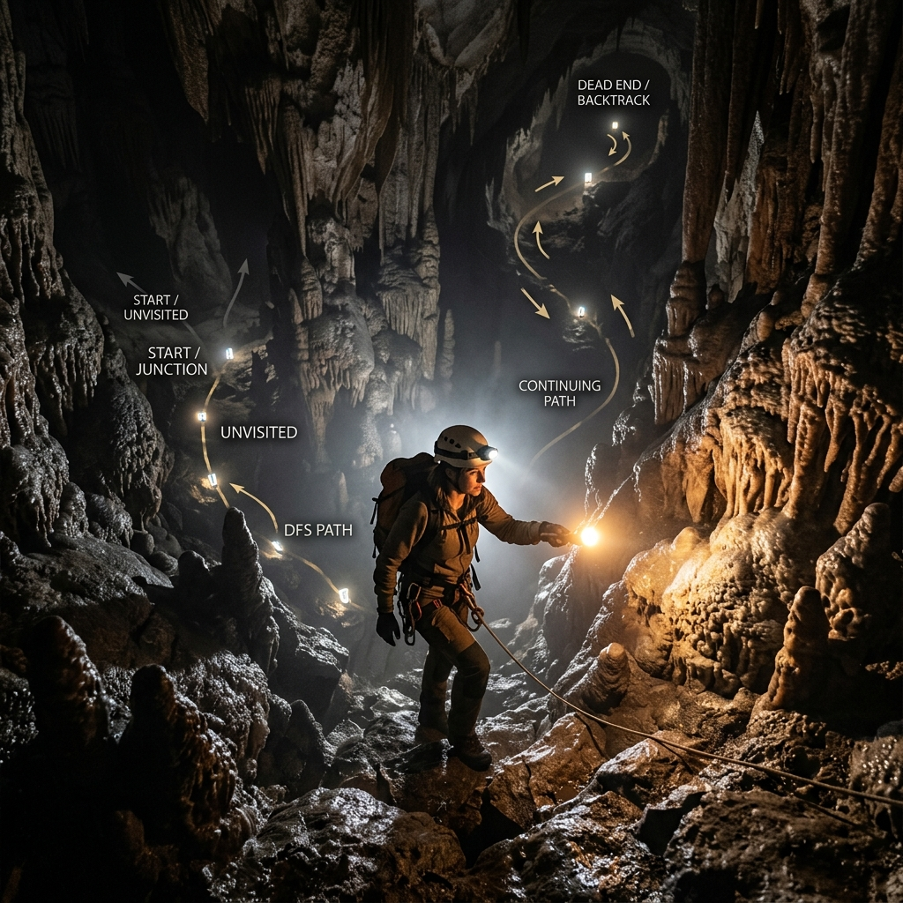
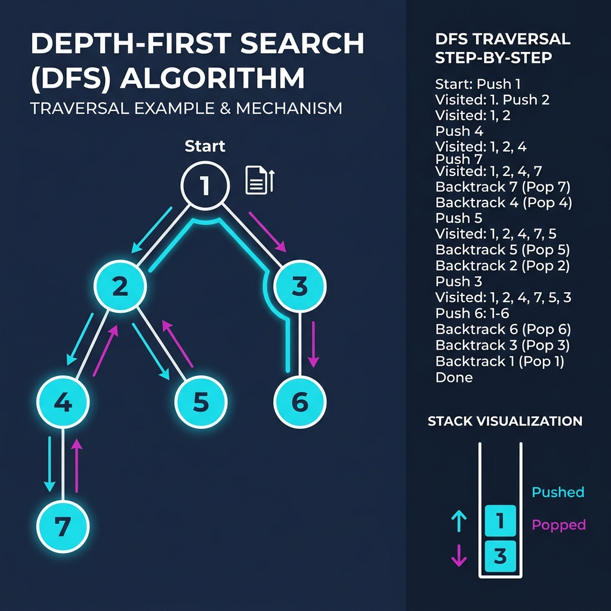

# Chapter 9: Depth-First Search (DFS)

<p align="center">
  
</p>

## Introduction

Depth-First Search explores a graph by going **as deep as possible** along each branch before **backtracking**. It's the counterpart to BFS — where BFS goes wide, DFS goes deep.

> **Key Insight** (from *CLRS* Ch. 22): "DFS explores edges out of the most recently discovered vertex that still has unexplored edges. When all edges have been explored, the search backtracks."

### When to Use DFS

- **Cycle detection** in graphs
- **Topological sorting** of directed acyclic graphs (DAGs)
- **Finding connected components**
- **Solving mazes** and puzzles
- **Path existence** checking (is there ANY path from A to B?)

---

## How It Works

DFS uses a **stack** (or recursion, which implicitly uses the call stack):

1. Start at source, push onto stack, mark visited
2. **Pop** top of stack, process it
3. **Push all unvisited neighbors** onto the stack
4. **Repeat** until stack is empty

### Visual Walkthrough

<p align="center">
  
</p>

### DFS vs BFS

| Feature | DFS | BFS |
|---------|-----|-----|
| **Data Structure** | Stack (LIFO) | Queue (FIFO) |
| **Exploration** | Goes deep first | Goes wide first |
| **Shortest Path** | ❌ Not guaranteed | ✅ Yes (unweighted) |
| **Memory** | O(depth) | O(breadth) |
| **Use Cases** | Cycle detection, topological sort | Shortest path, level order |

---

## Mathematical Foundation

DFS structures a graph $G=(V,E)$ into a set of disjoint trees (a DFS forest). The mathematical properties of DFS are closely related to the discovery and finish times of each vertex.

Let $d[v]$ be the timestamp when vertex $v$ is first discovered (colored gray), and $f[v]$ be the timestamp when the search finishes examining $v$'s adjacency list (colored black).

**Parenthesis Theorem:**
In any DFS of a graph, for any two vertices $u$ and $v$, exactly one of the following three conditions holds:
1. The intervals $[d[u], f[u]]$ and $[d[v], f[v]]$ are entirely disjoint, and neither $u$ nor $v$ is a descendant of the other.
2. $[d[u], f[u]]$ is contained entirely within $[d[v], f[v]]$, and $u$ is a descendant of $v$.
3. $[d[v], f[v]]$ is contained entirely within $[d[u], f[u]]$, and $v$ is a descendant of $u$.

**White-Path Theorem:**
In a DFS forest of a graph, vertex $v$ is a descendant of vertex $u$ if and only if at the time $d[u]$ that the search discovers $u$, there is a path from $u$ to $v$ consisting entirely of white (undiscovered) vertices.

These properties are mathematically foundational for algorithms like Topological Sort and finding Strongly Connected Components.

---

## Complexity Analysis

| Metric | Complexity |
|--------|-----------|
| **Time** | O(V + E) |
| **Space** | O(V) — visited set + recursion stack |

---

## Implementations

### Java

```java
import java.util.*;

public class DFS {

    /** Recursive DFS */
    public static void dfsRecursive(Map<String, List<String>> graph,
                                     String node, Set<String> visited) {
        if (visited.contains(node)) return;
        visited.add(node);
        System.out.print(node + " ");

        for (String neighbor : graph.getOrDefault(node, List.of())) {
            dfsRecursive(graph, neighbor, visited);
        }
    }

    /** Iterative DFS using explicit stack */
    public static List<String> dfsIterative(Map<String, List<String>> graph,
                                             String start) {
        List<String> result = new ArrayList<>();
        Deque<String> stack = new ArrayDeque<>();
        Set<String> visited = new HashSet<>();

        stack.push(start);

        while (!stack.isEmpty()) {
            String node = stack.pop();
            if (visited.contains(node)) continue;
            visited.add(node);
            result.add(node);

            List<String> neighbors = graph.getOrDefault(node, List.of());
            for (int i = neighbors.size() - 1; i >= 0; i--) {
                if (!visited.contains(neighbors.get(i))) {
                    stack.push(neighbors.get(i));
                }
            }
        }
        return result;
    }

    /** Detect cycle in a directed graph using DFS */
    public static boolean hasCycle(Map<String, List<String>> graph) {
        Set<String> visited = new HashSet<>();
        Set<String> recStack = new HashSet<>();

        for (String node : graph.keySet()) {
            if (hasCycleDFS(graph, node, visited, recStack))
                return true;
        }
        return false;
    }

    private static boolean hasCycleDFS(Map<String, List<String>> graph,
                                        String node, Set<String> visited,
                                        Set<String> recStack) {
        if (recStack.contains(node)) return true;
        if (visited.contains(node)) return false;

        visited.add(node);
        recStack.add(node);

        for (String neighbor : graph.getOrDefault(node, List.of())) {
            if (hasCycleDFS(graph, neighbor, visited, recStack))
                return true;
        }

        recStack.remove(node);
        return false;
    }

    public static void main(String[] args) {
        Map<String, List<String>> graph = new HashMap<>();
        graph.put("1", List.of("2", "3"));
        graph.put("2", List.of("4", "5"));
        graph.put("3", List.of("6"));
        graph.put("4", List.of("7"));
        graph.put("5", List.of());
        graph.put("6", List.of());
        graph.put("7", List.of());

        System.out.print("Recursive DFS: ");
        dfsRecursive(graph, "1", new HashSet<>());
        System.out.println();
        System.out.println("Iterative DFS: " + dfsIterative(graph, "1"));
        System.out.println("Has cycle: " + hasCycle(graph));
    }
}
```

### Python

```python
def dfs_recursive(graph: dict, node: str, visited: set = None) -> list[str]:
    """Recursive DFS traversal."""
    if visited is None:
        visited = set()

    visited.add(node)
    result = [node]

    for neighbor in graph.get(node, []):
        if neighbor not in visited:
            result.extend(dfs_recursive(graph, neighbor, visited))

    return result


def dfs_iterative(graph: dict, start: str) -> list[str]:
    """Iterative DFS using an explicit stack."""
    visited = set()
    stack = [start]
    result = []

    while stack:
        node = stack.pop()
        if node in visited:
            continue
        visited.add(node)
        result.append(node)

        # Push neighbors in reverse order for consistent traversal
        for neighbor in reversed(graph.get(node, [])):
            if neighbor not in visited:
                stack.append(neighbor)

    return result


def has_cycle(graph: dict) -> bool:
    """Detect cycle in directed graph using DFS."""
    visited = set()
    rec_stack = set()

    def dfs(node):
        if node in rec_stack:
            return True
        if node in visited:
            return False
        visited.add(node)
        rec_stack.add(node)
        for neighbor in graph.get(node, []):
            if dfs(neighbor):
                return True
        rec_stack.remove(node)
        return False

    return any(dfs(node) for node in graph if node not in visited)


if __name__ == "__main__":
    graph = {
        "1": ["2", "3"], "2": ["4", "5"], "3": ["6"],
        "4": ["7"], "5": [], "6": [], "7": [],
    }

    print(f"Recursive DFS: {dfs_recursive(graph, '1')}")
    print(f"Iterative DFS: {dfs_iterative(graph, '1')}")
    print(f"Has cycle: {has_cycle(graph)}")
```

### C++

```cpp
#include <iostream>
#include <vector>
#include <stack>
#include <unordered_map>
#include <unordered_set>
#include <string>

using Graph = std::unordered_map<std::string, std::vector<std::string>>;

void dfsRecursive(const Graph& graph, const std::string& node,
                  std::unordered_set<std::string>& visited) {
    if (visited.count(node)) return;
    visited.insert(node);
    std::cout << node << " ";

    if (graph.count(node)) {
        for (const auto& neighbor : graph.at(node)) {
            dfsRecursive(graph, neighbor, visited);
        }
    }
}

std::vector<std::string> dfsIterative(const Graph& graph,
                                       const std::string& start) {
    std::vector<std::string> result;
    std::stack<std::string> stk;
    std::unordered_set<std::string> visited;

    stk.push(start);
    while (!stk.empty()) {
        std::string node = stk.top(); stk.pop();
        if (visited.count(node)) continue;
        visited.insert(node);
        result.push_back(node);

        if (graph.count(node)) {
            const auto& neighbors = graph.at(node);
            for (auto it = neighbors.rbegin(); it != neighbors.rend(); ++it) {
                if (!visited.count(*it)) stk.push(*it);
            }
        }
    }
    return result;
}

int main() {
    Graph graph = {
        {"1", {"2", "3"}}, {"2", {"4", "5"}}, {"3", {"6"}},
        {"4", {"7"}}, {"5", {}}, {"6", {}}, {"7", {}}
    };

    std::cout << "Recursive DFS: ";
    std::unordered_set<std::string> visited;
    dfsRecursive(graph, "1", visited);
    std::cout << std::endl;

    std::cout << "Iterative DFS: ";
    for (const auto& n : dfsIterative(graph, "1"))
        std::cout << n << " ";
    std::cout << std::endl;

    return 0;
}
```

---

## Key Takeaways

1. **Uses a stack** (or recursion) — LIFO order gives deep-first behavior
2. **O(V + E)** — same complexity as BFS
3. **Not shortest path** — DFS doesn't guarantee shortest path in unweighted graphs
4. **Cycle detection** — use a recursion stack to detect back edges
5. **Topological sort** — reverse post-order of DFS gives topological ordering

> **Sources**: *CLRS* Ch. 22, *The Algorithm Design Manual* (Skiena), *Grokking Algorithms* Ch. 6

---

| [← Hash Tables](08-hash-tables.md) | [Next: Hungarian Algorithm →](10-hungarian-algorithm.md) |
|:------------------------------------|----------------------------------------------------------:|
