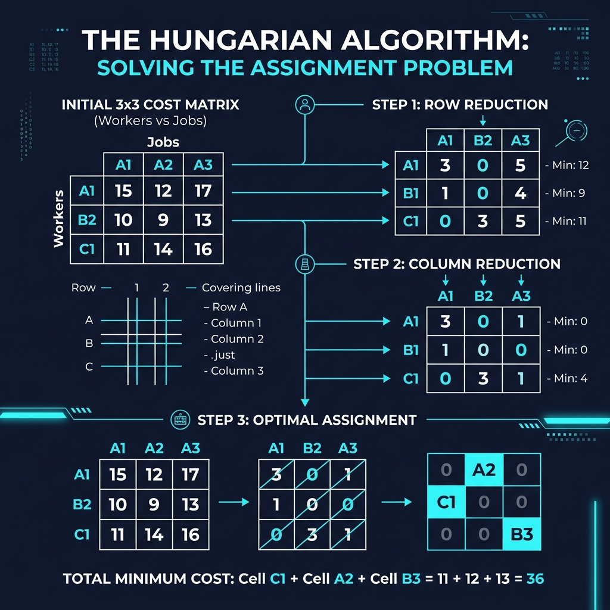

# Chapter 10: The Hungarian Algorithm

<p align="center">
  
</p>

## Introduction

The Hungarian algorithm (also known as the Kuhn-Munkres algorithm) solves the **assignment problem**: given a set of workers and tasks with associated costs, find the **optimal one-to-one assignment** that minimizes (or maximizes) the total cost.

> **Historical Context**: Developed by Harold Kuhn in 1955, inspired by the work of two Hungarian mathematicians, Dénes Kőnig and Jenő Egerváry. James Munkres later proved it runs in polynomial time.

### When to Use

- **Job assignment** — assigning workers to tasks minimizing total cost
- **Resource allocation** — matching resources to demands optimally
- **Transportation problems** — optimal routing of goods
- **Bipartite matching** — finding maximum-weight matchings in bipartite graphs

---

## How It Works

Given an n×n cost matrix:

1. **Row reduction**: Subtract the minimum of each row from all elements in that row
2. **Column reduction**: Subtract the minimum of each column from all elements in that column
3. **Cover zeros**: Draw minimum number of lines (rows/columns) to cover all zeros
4. **If lines = n**: optimal assignment found at zero positions
5. **If lines < n**: adjust matrix and repeat from step 3

### Visual Walkthrough

<p align="center">
  
</p>

### Worked Example

Assign 3 workers to 3 jobs with cost matrix:

|        | Job 1 | Job 2 | Job 3 |
|--------|-------|-------|-------|
| **Worker A** | 15 | 12 | 17 |
| **Worker B** | 10 | 9 | 13 |
| **Worker C** | 11 | 14 | 16 |

**Step 1 — Row reduction** (subtract row minimums: 12, 9, 11):

|   | J1 | J2 | J3 |
|---|----|----|-----|
| A | 3  | 0  | 5   |
| B | 1  | 0  | 4   |
| C | 0  | 3  | 5   |

**Step 2 — Column reduction** (subtract column minimums: 0, 0, 4):

|   | J1 | J2 | J3 |
|---|----|----|-----|
| A | 3  | 0  | 1   |
| B | 1  | 0  | 0   |
| C | 0  | 3  | 1   |

**Step 3** — Optimal assignment: **A→J2 (12), B→J3 (13), C→J1 (11) = Total: 36** ✅

---

## Mathematical Foundation

The Hungarian Algorithm is built upon **Kőnig's Theorem** and operations on bipartite graphs.

Let $C$ be an $n \times n$ cost matrix representing a bipartite graph $G = (U, V, E)$ where we want to find a perfect matching of minimum weight.
The algorithm relies on the fact that if we add or subtract a constant from every element of a row or column of the cost matrix, the optimal assignment remains unchanged.

Let $u_i$ be potentials for the workers and $v_j$ be potentials for the jobs. The reduced cost matrix $C'$ is defined mathematically as:
$$ C'_{i,j} = C_{i,j} - u_i - v_j $$

**Equality Subgraph:**
The algorithm searches for a perfect matching using only edges where the reduced cost is exactly $0$:
$$ E_{eq} = \{ (i, j) \in E \mid C_{i,j} - u_i - v_j = 0 \} $$

**Kőnig's Theorem Application:**
If a perfect matching cannot be found in the equality subgraph, the maximum cardinality of a matching is equal to the minimum number of lines (rows and columns) required to cover all zeros in the matrix.
The algorithm increments/decrements the potentials $u_i$ and $v_j$ based on the minimum uncovered value $\delta$, continuously modifying $C'$ until a perfect matching $M$ where $|M| = n$ is found in the equality subgraph.

---

## Complexity Analysis

| Metric | Complexity |
|--------|-----------|
| **Time** | O(n³) |
| **Space** | O(n²) |

> **From the Hungarian Algorithm papers**: The algorithm runs in O(n³) time for an n×n cost matrix, making it practical for medium-sized assignment problems.

---

## Implementations

### Java

```java
import java.util.Arrays;

public class HungarianAlgorithm {

    public static int[] hungarian(int[][] costMatrix) {
        int n = costMatrix.length;
        int[] u = new int[n + 1], v = new int[n + 1];
        int[] p = new int[n + 1], way = new int[n + 1];

        for (int i = 1; i <= n; i++) {
            p[0] = i;
            int j0 = 0;
            int[] minv = new int[n + 1];
            boolean[] used = new boolean[n + 1];
            Arrays.fill(minv, Integer.MAX_VALUE);

            do {
                used[j0] = true;
                int i0 = p[j0], delta = Integer.MAX_VALUE, j1 = 0;

                for (int j = 1; j <= n; j++) {
                    if (!used[j]) {
                        int cur = costMatrix[i0 - 1][j - 1] - u[i0] - v[j];
                        if (cur < minv[j]) {
                            minv[j] = cur;
                            way[j] = j0;
                        }
                        if (minv[j] < delta) {
                            delta = minv[j];
                            j1 = j;
                        }
                    }
                }

                for (int j = 0; j <= n; j++) {
                    if (used[j]) { u[p[j]] += delta; v[j] -= delta; }
                    else { minv[j] -= delta; }
                }
                j0 = j1;
            } while (p[j0] != 0);

            do {
                int j1 = way[j0];
                p[j0] = p[j1];
                j0 = j1;
            } while (j0 != 0);
        }

        int[] result = new int[n];
        for (int j = 1; j <= n; j++) {
            result[p[j] - 1] = j - 1;
        }
        return result;
    }

    public static void main(String[] args) {
        int[][] cost = {
            {15, 12, 17},
            {10,  9, 13},
            {11, 14, 16}
        };

        int[] assignment = hungarian(cost);
        int totalCost = 0;
        String[] workers = {"A", "B", "C"};

        for (int i = 0; i < assignment.length; i++) {
            totalCost += cost[i][assignment[i]];
            System.out.println("Worker " + workers[i] + " → Job " +
                             (assignment[i] + 1) + " (cost: " + cost[i][assignment[i]] + ")");
        }
        System.out.println("Total minimum cost: " + totalCost);
    }
}
```

### Python

```python
import numpy as np


def hungarian(cost_matrix: list[list[int]]) -> tuple[list[int], int]:
    """
    Hungarian algorithm for the assignment problem.
    Returns (assignment, total_cost).
    """
    cost = np.array(cost_matrix, dtype=float)
    n = cost.shape[0]

    # Step 1: Row reduction
    cost -= cost.min(axis=1, keepdims=True)

    # Step 2: Column reduction
    cost -= cost.min(axis=0, keepdims=True)

    # Step 3-5: Find optimal assignment
    assignment = [-1] * n
    assigned_cols = set()

    def try_assign():
        """Try to find assignment using only zero entries."""
        nonlocal assignment, assigned_cols
        assignment = [-1] * n
        assigned_cols = set()
        for i in range(n):
            for j in range(n):
                if cost[i][j] == 0 and j not in assigned_cols:
                    assignment[i] = j
                    assigned_cols.add(j)
                    break
        return len(assigned_cols) == n

    while not try_assign():
        # Cover zeros with minimum lines and adjust
        row_covered = [assignment[i] != -1 for i in range(n)]
        col_covered = [j in assigned_cols for j in range(n)]

        # Find minimum uncovered value
        min_val = float('inf')
        for i in range(n):
            for j in range(n):
                if not row_covered[i] and not col_covered[j]:
                    min_val = min(min_val, cost[i][j])

        # Adjust matrix
        for i in range(n):
            for j in range(n):
                if not row_covered[i] and not col_covered[j]:
                    cost[i][j] -= min_val
                elif row_covered[i] and col_covered[j]:
                    cost[i][j] += min_val

    total = sum(cost_matrix[i][assignment[i]] for i in range(n))
    return assignment, total


if __name__ == "__main__":
    cost_matrix = [
        [15, 12, 17],
        [10,  9, 13],
        [11, 14, 16],
    ]
    workers = ["A", "B", "C"]

    assignment, total = hungarian(cost_matrix)

    for i, j in enumerate(assignment):
        print(f"Worker {workers[i]} → Job {j + 1} (cost: {cost_matrix[i][j]})")
    print(f"Total minimum cost: {total}")
```

### C++

```cpp
#include <iostream>
#include <vector>
#include <climits>
#include <algorithm>

std::vector<int> hungarian(const std::vector<std::vector<int>>& costMatrix) {
    int n = costMatrix.size();
    std::vector<int> u(n + 1, 0), v(n + 1, 0), p(n + 1, 0), way(n + 1, 0);

    for (int i = 1; i <= n; i++) {
        p[0] = i;
        int j0 = 0;
        std::vector<int> minv(n + 1, INT_MAX);
        std::vector<bool> used(n + 1, false);

        do {
            used[j0] = true;
            int i0 = p[j0], delta = INT_MAX, j1 = 0;

            for (int j = 1; j <= n; j++) {
                if (!used[j]) {
                    int cur = costMatrix[i0 - 1][j - 1] - u[i0] - v[j];
                    if (cur < minv[j]) { minv[j] = cur; way[j] = j0; }
                    if (minv[j] < delta) { delta = minv[j]; j1 = j; }
                }
            }

            for (int j = 0; j <= n; j++) {
                if (used[j]) { u[p[j]] += delta; v[j] -= delta; }
                else { minv[j] -= delta; }
            }
            j0 = j1;
        } while (p[j0] != 0);

        do { int j1 = way[j0]; p[j0] = p[j1]; j0 = j1; } while (j0);
    }

    std::vector<int> result(n);
    for (int j = 1; j <= n; j++) result[p[j] - 1] = j - 1;
    return result;
}

int main() {
    std::vector<std::vector<int>> cost = {
        {15, 12, 17},
        {10,  9, 13},
        {11, 14, 16}
    };
    std::string workers[] = {"A", "B", "C"};

    auto assignment = hungarian(cost);
    int total = 0;
    for (int i = 0; i < (int)assignment.size(); i++) {
        total += cost[i][assignment[i]];
        std::cout << "Worker " << workers[i] << " -> Job "
                  << (assignment[i] + 1) << " (cost: "
                  << cost[i][assignment[i]] << ")" << std::endl;
    }
    std::cout << "Total minimum cost: " << total << std::endl;

    return 0;
}
```

---

## Key Takeaways

1. **O(n³)** — polynomial time for the assignment problem
2. **Optimal guarantee** — always finds the minimum-cost assignment
3. **Works on bipartite graphs** — workers and tasks form a bipartite structure
4. **Matrix reduction** is the key insight — zeros mark possible optimal assignments
5. **Widely applicable** — scheduling, logistics, resource allocation

> **Sources**: Hungarian Algorithm papers in collection, *CLRS* Ch. 26, *The Algorithm Design Manual*

---

| [← DFS](09-dfs.md) | [Next: Greedy Algorithms →](11-greedy-algorithms.md) |
|:---------------------|-----------------------------------------------------:|
