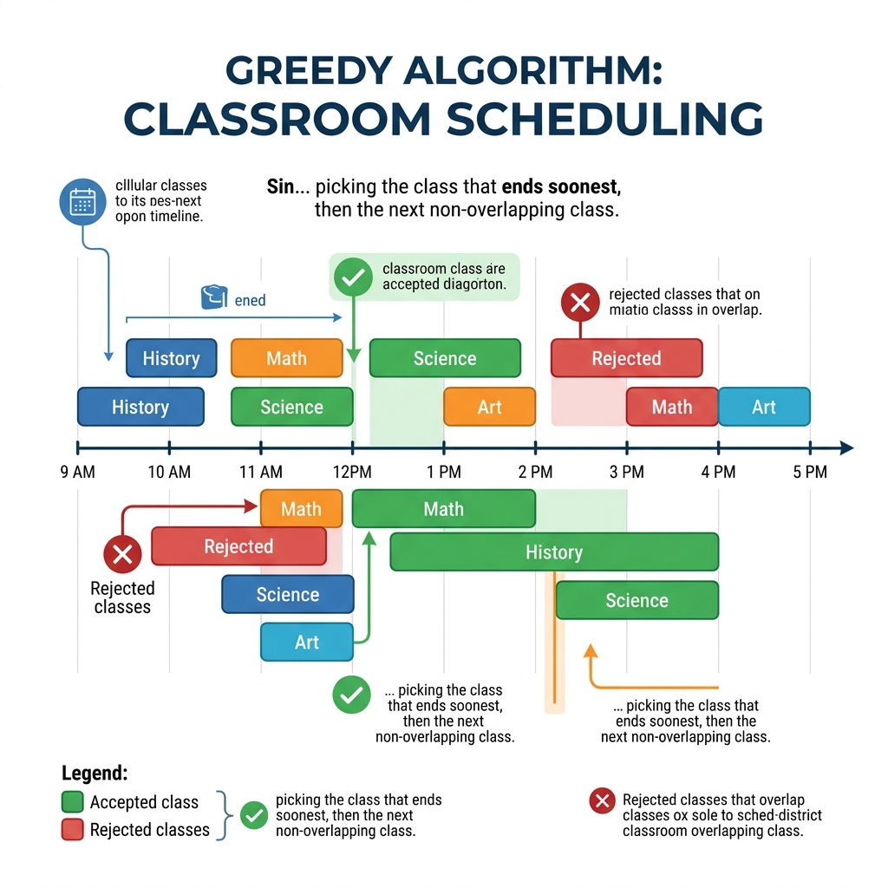

# Chapter 11: Greedy Algorithms

<p align="center">
  
</p>

## Introduction

Greedy algorithms build up a solution piece by piece, always choosing the **locally optimal** option at each step, hoping it leads to a **globally optimal** solution. They are beautifully simple and surprisingly powerful for many problems.

> **Key Insight** (from *Grokking Algorithms*, Ch. 8): "A greedy algorithm is simple: at each step, pick the optimal move. In technical terms: at each step you pick the locally optimal solution, and in the end you're left with the globally optimal solution."

### When to Use Greedy Algorithms

- The problem has **optimal substructure** — an optimal solution contains optimal solutions to subproblems
- A **greedy choice property** exists — locally optimal choices lead to a global optimum
- You need a **fast approximation** when exact solutions are too expensive (NP-complete problems)

### Real-World Applications

- **Activity/classroom scheduling** — maximizing the number of non-overlapping events
- **Huffman coding** — optimal data compression
- **Minimum spanning trees** — Kruskal's and Prim's algorithms
- **Making change** — selecting coins to minimize total count
- **Set cover approximation** — covering all elements with fewest subsets

---

## How It Works

The classic example is the **Activity Selection Problem** (classroom scheduling):

1. **Sort** activities by their finish time
2. **Select** the first activity (earliest finish)
3. For each remaining activity: if it **starts after** the last selected activity ends, **select it**
4. **Repeat** until all activities are considered

### Step-by-Step Visual Walkthrough

<p align="center">
  
</p>

### Worked Example

Given these classes with start and end times:

| Class | Start | End |
|-------|-------|-----|
| Art | 9:00 | 10:00 |
| English | 9:30 | 10:30 |
| Math | 10:00 | 11:00 |
| CS | 10:30 | 11:30 |
| Music | 11:00 | 12:00 |

| Step | Consider | Conflict? | Action |
|------|----------|-----------|--------|
| 1 | Art (9–10) | No | ✅ **Select** (ends earliest) |
| 2 | English (9:30–10:30) | Yes (overlaps Art) | ❌ Skip |
| 3 | Math (10–11) | No | ✅ **Select** |
| 4 | CS (10:30–11:30) | Yes (overlaps Math) | ❌ Skip |
| 5 | Music (11–12) | No | ✅ **Select** |

**Result**: 3 classes (Art, Math, Music) — the **maximum** possible! ✅

---

## Mathematical Foundation

Greedy algorithms do not work for all optimization problems. Mathematically, a problem can be solved optimally with a greedy approach if and only if it exhibits two specific properties:

1. **Greedy Choice Property:** A global optimum can be arrived at by selecting a local optimum. In a mathematical sense, there exists an optimal solution to the problem that contains the greedy choice.
2. **Optimal Substructure:** An optimal solution to the problem contains optimal solutions to the subproblems.

**Matroid Theory Foundation:**
More rigorously, the problems perfectly solvable by greedy algorithms can be modeled as **Matroids**. 
A matroid is an ordered pair $M = (S, I)$ where:
- $S$ is a finite set.
- $I$ is a non-empty family of subsets of $S$, called independent sets, such that if $B \in I$ and $A \subset B$, then $A \in I$ (hereditary property).
- If $A \in I$, $B \in I$, and $|A| < |B|$, there is some element $x \in B - A$ such that $A \cup \{x\} \in I$ (exchange property).

For example, in the **Activity Selection Problem**, we have a set of activities $S = \{a_1, a_2, \dots, a_n\}$.
Assuming activities are sorted by finish time $f_1 \le f_2 \le \dots \le f_n$, the greedy choice property mathematically proves that there exists a maximum-size subset of mutually compatible activities that contains $a_1$.

---

## Complexity Analysis

| Metric | Complexity | Explanation |
|--------|-----------|-------------|
| **Time** | O(n log n) | Dominated by sorting; greedy selection is O(n) |
| **Space** | O(1) | Only tracking the last selected activity |

> **From *Introduction to Algorithms* (CLRS), Ch. 16:** "An activity-selection problem... We can solve this problem using a greedy algorithm by repeatedly choosing the activity that finishes first, is compatible with all previously selected activities."

### When Greedy Fails

Not all problems yield to greedy approaches. The **knapsack problem** is a classic counterexample:
- Greedy (pick most valuable first) gives $3,000 (stereo)
- Optimal solution gives $3,500 (laptop + guitar)
- **Dynamic programming** is needed for the optimal solution (see Chapter 7)

---

## Implementations

### Java

```java
import java.util.*;

public class GreedyActivitySelection {

    /**
     * Activity Selection using a greedy approach.
     * Selects the maximum number of non-overlapping activities.
     */
    public static List<int[]> selectActivities(int[][] activities) {
        // Sort by finish time
        Arrays.sort(activities, Comparator.comparingInt(a -> a[1]));

        List<int[]> selected = new ArrayList<>();
        selected.add(activities[0]);
        int lastEnd = activities[0][1];

        for (int i = 1; i < activities.length; i++) {
            if (activities[i][0] >= lastEnd) {
                selected.add(activities[i]);
                lastEnd = activities[i][1];
            }
        }
        return selected;
    }

    /**
     * Set Cover approximation using a greedy approach.
     */
    public static List<String> setCover(Set<String> universe,
                                         Map<String, Set<String>> subsets) {
        List<String> cover = new ArrayList<>();
        Set<String> remaining = new HashSet<>(universe);

        while (!remaining.isEmpty()) {
            String best = null;
            Set<String> bestCover = Collections.emptySet();

            for (var entry : subsets.entrySet()) {
                Set<String> intersection = new HashSet<>(entry.getValue());
                intersection.retainAll(remaining);
                if (intersection.size() > bestCover.size()) {
                    best = entry.getKey();
                    bestCover = intersection;
                }
            }

            remaining.removeAll(bestCover);
            cover.add(best);
            subsets.remove(best);
        }
        return cover;
    }

    public static void main(String[] args) {
        // Activity Selection
        int[][] activities = {{9, 10}, {9, 11}, {10, 11}, {10, 12}, {11, 12}};
        List<int[]> selected = selectActivities(activities);

        System.out.println("Selected activities:");
        for (int[] act : selected) {
            System.out.println("  [" + act[0] + ", " + act[1] + ")");
        }

        // Set Cover
        Set<String> states = new HashSet<>(Arrays.asList(
            "mt", "wa", "or", "id", "nv", "ut", "ca", "az"));
        Map<String, Set<String>> stations = new HashMap<>();
        stations.put("kone",   new HashSet<>(Arrays.asList("id", "nv", "ut")));
        stations.put("ktwo",   new HashSet<>(Arrays.asList("wa", "id", "mt")));
        stations.put("kthree", new HashSet<>(Arrays.asList("or", "nv", "ca")));
        stations.put("kfour",  new HashSet<>(Arrays.asList("nv", "ut")));
        stations.put("kfive",  new HashSet<>(Arrays.asList("ca", "az")));

        System.out.println("Set cover: " + setCover(states, stations));
    }
}
```

### Python

```python
def select_activities(activities: list[tuple[int, int]]) -> list[tuple[int, int]]:
    """
    Greedy Activity Selection.
    Returns the maximum set of non-overlapping activities.
    """
    # Sort by finish time
    sorted_acts = sorted(activities, key=lambda x: x[1])

    selected = [sorted_acts[0]]
    last_end = sorted_acts[0][1]

    for start, end in sorted_acts[1:]:
        if start >= last_end:
            selected.append((start, end))
            last_end = end

    return selected


def set_cover(universe: set[str],
              subsets: dict[str, set[str]]) -> list[str]:
    """
    Greedy Set Cover approximation.
    Returns a list of subset names that cover the universe.
    """
    remaining = set(universe)
    cover = []

    while remaining:
        # Pick the subset covering the most uncovered elements
        best = max(subsets, key=lambda s: len(subsets[s] & remaining))
        remaining -= subsets[best]
        cover.append(best)
        del subsets[best]

    return cover


if __name__ == "__main__":
    # Activity Selection
    activities = [(9, 10), (9, 11), (10, 11), (10, 12), (11, 12)]
    selected = select_activities(activities)
    print(f"Selected activities: {selected}")

    # Set Cover
    states = {"mt", "wa", "or", "id", "nv", "ut", "ca", "az"}
    stations = {
        "kone":   {"id", "nv", "ut"},
        "ktwo":   {"wa", "id", "mt"},
        "kthree": {"or", "nv", "ca"},
        "kfour":  {"nv", "ut"},
        "kfive":  {"ca", "az"},
    }
    print(f"Set cover: {set_cover(states, stations)}")
```

### C++

```cpp
#include <iostream>
#include <vector>
#include <algorithm>
#include <set>
#include <map>
#include <string>

struct Activity {
    int start, end;
};

/**
 * Greedy Activity Selection.
 * Selects maximum non-overlapping activities sorted by finish time.
 */
std::vector<Activity> selectActivities(std::vector<Activity> activities) {
    std::sort(activities.begin(), activities.end(),
              [](const Activity& a, const Activity& b) { return a.end < b.end; });

    std::vector<Activity> selected;
    selected.push_back(activities[0]);
    int lastEnd = activities[0].end;

    for (size_t i = 1; i < activities.size(); i++) {
        if (activities[i].start >= lastEnd) {
            selected.push_back(activities[i]);
            lastEnd = activities[i].end;
        }
    }
    return selected;
}

int main() {
    std::vector<Activity> activities = {{9,10}, {9,11}, {10,11}, {10,12}, {11,12}};

    auto selected = selectActivities(activities);

    std::cout << "Selected activities:" << std::endl;
    for (const auto& act : selected) {
        std::cout << "  [" << act.start << ", " << act.end << ")" << std::endl;
    }

    return 0;
}
```

---

## Key Takeaways

1. **Greedy = locally optimal choices** — pick the best option at each step
2. **Not always optimal** — works only when greedy choice property holds
3. **Fast and simple** — often O(n log n) dominated by sorting
4. **Great for approximation** — set cover, traveling salesman approximations
5. **Contrast with DP** — greedy makes irrevocable choices; DP considers all subproblems

> **Sources**: *Grokking Algorithms* Ch. 8, *Introduction to Algorithms* (CLRS) Ch. 16, *The Algorithm Design Manual* (Skiena) Ch. 1

---

| [← Hungarian Algorithm](10-hungarian-algorithm.md) | [Next: Heapsort →](12-heapsort.md) |
|:----------------------------------------------------|-----------------------------------:|
