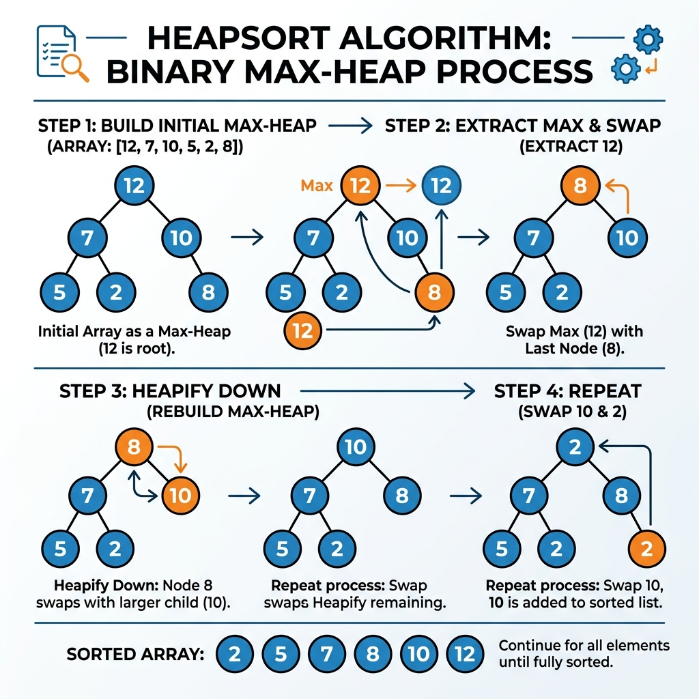

# Chapter 12: Heapsort

<p align="center">
  
</p>

## Introduction

Heapsort is a comparison-based sorting algorithm that leverages the **heap data structure** — a nearly complete binary tree stored as an array. It combines the best attributes of merge sort (O(n log n) guaranteed) and insertion sort (in-place sorting).

> **Key Insight** (from *Introduction to Algorithms* (CLRS), Ch. 6): "Heapsort combines the better attributes of the two sorting algorithms we have already discussed. Like merge sort, heapsort's running time is O(n lg n). Like insertion sort, heapsort sorts in place."

### When to Use Heapsort

- You need **guaranteed O(n log n)** worst-case performance
- **In-place sorting** is required (O(1) extra space)
- Building a **priority queue** — heaps are the underlying structure
- When you need to repeatedly extract the **min or max** element

### Real-World Applications

- **Priority queues** — task scheduling in operating systems
- **Dijkstra's algorithm** — uses a min-heap for efficient shortest-path computation
- **Median maintenance** — using two heaps to track the running median
- **Event-driven simulation** — processing events in chronological order
- **Order statistics** — finding the k-th largest/smallest element

---

## How It Works

Heapsort operates in two phases:

**Phase 1 — Build a Max-Heap:**
1. Arrange the array into a **max-heap** where every parent ≥ its children
2. The largest element is now at the root (index 0)

**Phase 2 — Sort by Extraction:**
1. **Swap** the root (maximum) with the last unsorted element
2. **Reduce** the heap size by one
3. **Heapify** the root to restore the max-heap property
4. **Repeat** until the heap is empty

### Step-by-Step Visual Walkthrough

<p align="center">
  
</p>

### Worked Example

Sorting the array `[4, 10, 3, 5, 1]`:

**Build Max-Heap:** `[10, 5, 3, 4, 1]`

| Step | Swap | Array After Swap | Heapify | Sorted Portion |
|------|------|-----------------|---------|----------------|
| 1 | 10 ↔ 1 | [1, 5, 3, 4, **10**] | → [5, 4, 3, 1] | [10] |
| 2 | 5 ↔ 1 | [1, 4, 3, **5**, **10**] | → [4, 1, 3] | [5, 10] |
| 3 | 4 ↔ 1 | [1, 3, **4**, **5**, **10**] | → [3, 1] | [4, 5, 10] |
| 4 | 3 ↔ 1 | [**1**, **3**, **4**, **5**, **10**] | — | ✅ **Sorted!** |

---

## Complexity Analysis

| Case | Time Complexity | Explanation |
|------|----------------|-------------|
| **Best** | O(n log n) | Always performs full heapify cycles |
| **Average** | O(n log n) | Consistent across all inputs |
| **Worst** | O(n log n) | **Guaranteed** — unlike quicksort's O(n²) |
| **Space** | O(1) | In-place — only constant extra memory |

> **From *CLRS* Ch. 6:** "The BUILD-MAX-HEAP procedure, which runs in linear time, produces a max-heap from an unordered input array. The HEAPSORT procedure, which runs in O(n lg n) time, sorts an array in place."

### Comparison with Other Sorts

| Algorithm | Best | Average | Worst | Space | Stable? |
|-----------|------|---------|-------|-------|---------|
| **Heapsort** | O(n log n) | O(n log n) | O(n log n) | O(1) | ❌ No |
| Merge Sort | O(n log n) | O(n log n) | O(n log n) | O(n) | ✅ Yes |
| Quicksort | O(n log n) | O(n log n) | O(n²) | O(log n) | ❌ No |

---

## Implementations

### Java

```java
public class HeapSort {

    /**
     * Sorts an array in-place using heapsort.
     */
    public static void heapSort(int[] arr) {
        int n = arr.length;

        // Phase 1: Build max-heap (start from last non-leaf)
        for (int i = n / 2 - 1; i >= 0; i--) {
            heapify(arr, n, i);
        }

        // Phase 2: Extract elements from heap one by one
        for (int i = n - 1; i > 0; i--) {
            // Swap root (maximum) with last element
            int temp = arr[0];
            arr[0] = arr[i];
            arr[i] = temp;

            // Heapify the reduced heap
            heapify(arr, i, 0);
        }
    }

    /**
     * Maintains the max-heap property for a subtree rooted at index i.
     * @param arr  the array representing the heap
     * @param n    the size of the heap
     * @param i    the index of the root of the subtree
     */
    private static void heapify(int[] arr, int n, int i) {
        int largest = i;
        int left = 2 * i + 1;
        int right = 2 * i + 2;

        if (left < n && arr[left] > arr[largest])
            largest = left;

        if (right < n && arr[right] > arr[largest])
            largest = right;

        if (largest != i) {
            int swap = arr[i];
            arr[i] = arr[largest];
            arr[largest] = swap;

            heapify(arr, n, largest);  // recursively heapify the affected subtree
        }
    }

    public static void main(String[] args) {
        int[] arr = {4, 10, 3, 5, 1};
        System.out.print("Before: ");
        for (int v : arr) System.out.print(v + " ");

        heapSort(arr);

        System.out.print("\nAfter:  ");
        for (int v : arr) System.out.print(v + " ");
        System.out.println();
    }
}
```

### Python

```python
def heap_sort(arr: list[int]) -> None:
    """Sorts an array in-place using heapsort."""
    n = len(arr)

    # Phase 1: Build max-heap
    for i in range(n // 2 - 1, -1, -1):
        _heapify(arr, n, i)

    # Phase 2: Extract elements one by one
    for i in range(n - 1, 0, -1):
        arr[0], arr[i] = arr[i], arr[0]  # swap root with last
        _heapify(arr, i, 0)              # heapify reduced heap


def _heapify(arr: list[int], n: int, i: int) -> None:
    """Maintain max-heap property for subtree rooted at index i."""
    largest = i
    left = 2 * i + 1
    right = 2 * i + 2

    if left < n and arr[left] > arr[largest]:
        largest = left

    if right < n and arr[right] > arr[largest]:
        largest = right

    if largest != i:
        arr[i], arr[largest] = arr[largest], arr[i]
        _heapify(arr, n, largest)


if __name__ == "__main__":
    arr = [4, 10, 3, 5, 1]
    print(f"Before: {arr}")
    heap_sort(arr)
    print(f"After:  {arr}")
```

### C++

```cpp
#include <iostream>
#include <vector>

/**
 * Maintain the max-heap property for a subtree rooted at index i.
 */
void heapify(std::vector<int>& arr, int n, int i) {
    int largest = i;
    int left = 2 * i + 1;
    int right = 2 * i + 2;

    if (left < n && arr[left] > arr[largest])
        largest = left;

    if (right < n && arr[right] > arr[largest])
        largest = right;

    if (largest != i) {
        std::swap(arr[i], arr[largest]);
        heapify(arr, n, largest);
    }
}

/**
 * Sorts a vector in-place using heapsort.
 */
void heapSort(std::vector<int>& arr) {
    int n = arr.size();

    // Phase 1: Build max-heap
    for (int i = n / 2 - 1; i >= 0; i--)
        heapify(arr, n, i);

    // Phase 2: Extract elements
    for (int i = n - 1; i > 0; i--) {
        std::swap(arr[0], arr[i]);
        heapify(arr, i, 0);
    }
}

int main() {
    std::vector<int> arr = {4, 10, 3, 5, 1};

    std::cout << "Before: ";
    for (int v : arr) std::cout << v << " ";

    heapSort(arr);

    std::cout << "\nAfter:  ";
    for (int v : arr) std::cout << v << " ";
    std::cout << std::endl;

    return 0;
}
```

---

## Key Takeaways

1. **O(n log n) guaranteed** — no worst-case degradation unlike quicksort
2. **In-place** — O(1) extra space, unlike merge sort's O(n)
3. **Heap data structure** — the key building block, also used in priority queues
4. **BUILD-MAX-HEAP is O(n)** — counterintuitively linear, not O(n log n)
5. **Not stable** — equal elements may change relative order

> **Sources**: *Introduction to Algorithms* (CLRS) Ch. 6, *A Common-Sense Guide to Data Structures and Algorithms* Ch. 16, *The Algorithm Design Manual* (Skiena) Ch. 4.3

---

| [← Greedy Algorithms](11-greedy-algorithms.md) | [Next: Topological Sort →](13-topological-sort.md) |
|:------------------------------------------------|---------------------------------------------------:|
