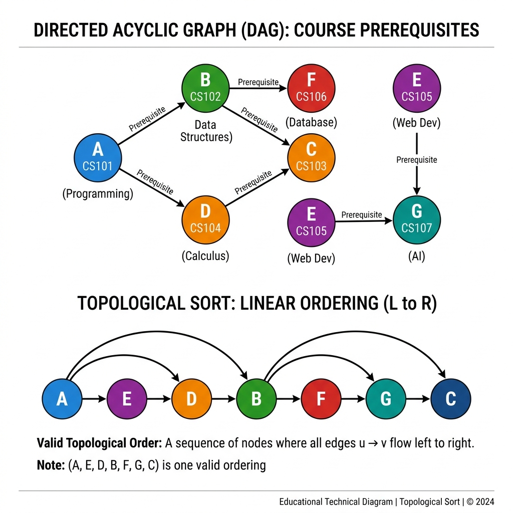

# Chapter 13: Topological Sort

<p align="center">
  
</p>

## Introduction

Topological sort produces a **linear ordering** of vertices in a directed acyclic graph (DAG) such that for every directed edge (u, v), vertex u appears **before** v. It answers the question: *"In what order should I do these tasks so that all prerequisites are satisfied?"*

> **Key Insight** (from *Introduction to Algorithms* (CLRS), Ch. 22.4): "A topological sort of a dag G = (V, E) is a linear ordering of all its vertices such that if G contains an edge (u, v), then u appears before v in the ordering."

### When to Use Topological Sort

- **Task scheduling** with dependencies (build systems, CI/CD pipelines)
- **Course prerequisite** planning — which courses to take first
- **Compilation order** — determining the order to compile source files
- **Spreadsheet cell evaluation** — computing cells in dependency order
- **Package installation** — resolving dependency chains

### Real-World Applications

- **Make/Gradle/Maven** — build tool dependency resolution
- **npm/pip install** — package manager dependency ordering
- **Database migration** — applying schema changes in order
- **Recipe steps** — certain ingredients must be prepared before others
- **Git commit history** — linearizing a DAG of commits

---

## How It Works

There are two classic approaches:

### Approach 1: Kahn's Algorithm (BFS-based)

1. Calculate the **in-degree** of each vertex
2. Add all vertices with **in-degree 0** to a queue
3. While the queue is not empty:
   - **Dequeue** a vertex, add it to the result
   - For each neighbor, **decrement** its in-degree
   - If a neighbor's in-degree becomes 0, **enqueue** it
4. If the result contains all vertices → valid topological order

### Approach 2: DFS-based

1. Run **DFS** on the graph
2. When a vertex finishes (all descendants explored), push it onto a **stack**
3. Pop all vertices from the stack → topological order

### Step-by-Step Visual Walkthrough

<p align="center">
  
</p>

### Worked Example (Kahn's Algorithm)

Course prerequisites:

```
CS101 (Programming) → CS102 (Data Structures)
CS101 → CS104 (Calculus)
CS102 → CS103 (Algorithms)
CS102 → CS106 (Databases)
CS104 → CS103
```

| Step | Queue | Dequeue | In-degrees After | Result |
|------|-------|---------|-----------------|--------|
| Init | [CS101] | — | CS102:1, CS104:1, CS103:2, CS106:1 | [] |
| 1 | [] | CS101 | CS102:0, CS104:0, CS103:2, CS106:1 | [CS101] |
| 2 | [CS102, CS104] | CS102 | CS103:1, CS106:0 | [CS101, CS102] |
| 3 | [CS104, CS106] | CS104 | CS103:0 | [CS101, CS102, CS104] |
| 4 | [CS106, CS103] | CS106 | — | [CS101, CS102, CS104, CS106] |
| 5 | [CS103] | CS103 | — | ✅ [CS101, CS102, CS104, CS106, CS103] |

---

## Mathematical Foundation

Topological sort is mathematically defined over a **Directed Acyclic Graph (DAG)** $G=(V, E)$. 

A topological sort is a linear ordering of vertices such that for every directed edge $(u, v) \in E$, vertex $u$ comes before $v$ in the ordering.
If the graph contains a directed cycle, no linear ordering is possible, because there would exist a path from a vertex to itself, requiring it to be scheduled both before and after itself.

**DFS Finish Time Property:**
In the DFS-based approach, let $f[u]$ be the finish time of vertex $u$. The correctness of topological sort relies on the following lemma:
> *For any directed edge $(u,v)$ in a DAG, $f[v] < f[u]$.*

**Proof sketch:**
When edge $(u,v)$ is explored during the DFS visit of $u$:
1. If $v$ is gray (currently being visited), it means there is a back edge, which contradicts the assumption that $G$ is a DAG.
2. If $v$ is white (unvisited), it becomes a descendant of $u$. The DFS will completely finish exploring $v$ (and its descendants) before returning to finish $u$. Thus $f[v] < f[u]$.
3. If $v$ is black (already finished), then its finish time $f[v]$ was already set, and $u$ is currently being explored. Thus $f[v] < f[u]$ trivially.

Because $f[u] > f[v]$ for all edges $(u,v)$, ordering vertices by descending finish time mathematically guarantees a valid topological sort.

---

## Complexity Analysis

| Metric | Complexity | Explanation |
|--------|-----------|-------------|
| **Time** | O(V + E) | Visit every vertex and edge once |
| **Space** | O(V) | Queue/stack + in-degree array |

> **From *CLRS* Ch. 22.4:** "We can perform a topological sort in time Θ(V + E), since depth-first search takes Θ(V + E) time and it takes O(1) time to insert each of the |V| vertices onto the front of the linked list."

### Cycle Detection

If the topological sort result contains **fewer vertices than V**, the graph has a **cycle** — and no valid topological ordering exists. Kahn's algorithm naturally detects this.

---

## Implementations

### Java

```java
import java.util.*;

public class TopologicalSort {

    /**
     * Kahn's Algorithm (BFS-based topological sort).
     * Returns empty list if a cycle is detected.
     */
    public static List<String> kahnSort(Map<String, List<String>> graph) {
        // Calculate in-degrees
        Map<String, Integer> inDegree = new HashMap<>();
        for (String node : graph.keySet()) {
            inDegree.putIfAbsent(node, 0);
            for (String neighbor : graph.get(node)) {
                inDegree.merge(neighbor, 1, Integer::sum);
            }
        }

        // Add all zero in-degree nodes to queue
        Queue<String> queue = new LinkedList<>();
        for (var entry : inDegree.entrySet()) {
            if (entry.getValue() == 0) queue.add(entry.getKey());
        }

        List<String> result = new ArrayList<>();

        while (!queue.isEmpty()) {
            String node = queue.poll();
            result.add(node);

            for (String neighbor : graph.getOrDefault(node, List.of())) {
                inDegree.merge(neighbor, -1, Integer::sum);
                if (inDegree.get(neighbor) == 0) {
                    queue.add(neighbor);
                }
            }
        }

        // Cycle detection
        if (result.size() != inDegree.size()) {
            return List.of();  // cycle detected
        }
        return result;
    }

    /**
     * DFS-based topological sort.
     */
    public static List<String> dfsSort(Map<String, List<String>> graph) {
        Set<String> visited = new HashSet<>();
        Deque<String> stack = new ArrayDeque<>();

        for (String node : graph.keySet()) {
            if (!visited.contains(node)) {
                dfsHelper(graph, node, visited, stack);
            }
        }

        return new ArrayList<>(stack);
    }

    private static void dfsHelper(Map<String, List<String>> graph,
                                   String node, Set<String> visited,
                                   Deque<String> stack) {
        visited.add(node);
        for (String neighbor : graph.getOrDefault(node, List.of())) {
            if (!visited.contains(neighbor)) {
                dfsHelper(graph, neighbor, visited, stack);
            }
        }
        stack.push(node);  // add after all descendants are done
    }

    public static void main(String[] args) {
        Map<String, List<String>> graph = new LinkedHashMap<>();
        graph.put("CS101", List.of("CS102", "CS104"));
        graph.put("CS102", List.of("CS103", "CS106"));
        graph.put("CS104", List.of("CS103"));
        graph.put("CS103", List.of());
        graph.put("CS106", List.of());

        System.out.println("Kahn's: " + kahnSort(graph));
        System.out.println("DFS:    " + dfsSort(graph));
    }
}
```

### Python

```python
from collections import deque


def kahn_sort(graph: dict[str, list[str]]) -> list[str]:
    """
    Kahn's Algorithm (BFS-based topological sort).
    Returns empty list if a cycle is detected.
    """
    # Calculate in-degrees
    in_degree = {node: 0 for node in graph}
    for node in graph:
        for neighbor in graph[node]:
            in_degree[neighbor] = in_degree.get(neighbor, 0) + 1

    # Start with zero in-degree nodes
    queue = deque(node for node in in_degree if in_degree[node] == 0)
    result = []

    while queue:
        node = queue.popleft()
        result.append(node)

        for neighbor in graph.get(node, []):
            in_degree[neighbor] -= 1
            if in_degree[neighbor] == 0:
                queue.append(neighbor)

    if len(result) != len(in_degree):
        return []  # cycle detected

    return result


def dfs_sort(graph: dict[str, list[str]]) -> list[str]:
    """DFS-based topological sort."""
    visited = set()
    stack = []

    def dfs(node: str):
        visited.add(node)
        for neighbor in graph.get(node, []):
            if neighbor not in visited:
                dfs(neighbor)
        stack.append(node)

    for node in graph:
        if node not in visited:
            dfs(node)

    return stack[::-1]  # reverse post-order


if __name__ == "__main__":
    graph = {
        "CS101": ["CS102", "CS104"],
        "CS102": ["CS103", "CS106"],
        "CS104": ["CS103"],
        "CS103": [],
        "CS106": [],
    }

    print(f"Kahn's: {kahn_sort(graph)}")
    print(f"DFS:    {dfs_sort(graph)}")
```

### C++

```cpp
#include <iostream>
#include <vector>
#include <queue>
#include <unordered_map>
#include <unordered_set>
#include <string>
#include <algorithm>

using Graph = std::unordered_map<std::string, std::vector<std::string>>;

/**
 * Kahn's Algorithm (BFS-based topological sort).
 */
std::vector<std::string> kahnSort(const Graph& graph) {
    std::unordered_map<std::string, int> inDegree;

    // Initialize in-degrees
    for (const auto& [node, neighbors] : graph) {
        inDegree.emplace(node, 0);
        for (const auto& neighbor : neighbors) {
            inDegree[neighbor]++;
        }
    }

    std::queue<std::string> q;
    for (const auto& [node, deg] : inDegree) {
        if (deg == 0) q.push(node);
    }

    std::vector<std::string> result;

    while (!q.empty()) {
        auto node = q.front();
        q.pop();
        result.push_back(node);

        if (graph.count(node)) {
            for (const auto& neighbor : graph.at(node)) {
                if (--inDegree[neighbor] == 0) {
                    q.push(neighbor);
                }
            }
        }
    }

    if (result.size() != inDegree.size()) {
        return {};  // cycle detected
    }
    return result;
}

int main() {
    Graph graph = {
        {"CS101", {"CS102", "CS104"}},
        {"CS102", {"CS103", "CS106"}},
        {"CS104", {"CS103"}},
        {"CS103", {}},
        {"CS106", {}}
    };

    std::cout << "Topological order: ";
    for (const auto& node : kahnSort(graph)) {
        std::cout << node << " ";
    }
    std::cout << std::endl;

    return 0;
}
```

---

## Key Takeaways

1. **Only works on DAGs** — directed acyclic graphs; cycles make it impossible
2. **Two approaches** — Kahn's (BFS, in-degree) and DFS-based (reverse post-order)
3. **O(V + E) time** — linear, same as BFS/DFS
4. **Cycle detection built-in** — Kahn's detects cycles when result is incomplete
5. **Multiple valid orderings** — topological sort is not unique for most graphs

> **Sources**: *Introduction to Algorithms* (CLRS) Ch. 22.4, *The Algorithm Design Manual* (Skiena) Ch. 5.1, *A Common-Sense Guide to Data Structures and Algorithms*

---

| [← Heapsort](12-heapsort.md) | [Next: K-Nearest Neighbors →](14-knn.md) |
|:------------------------------|------------------------------------------:|
