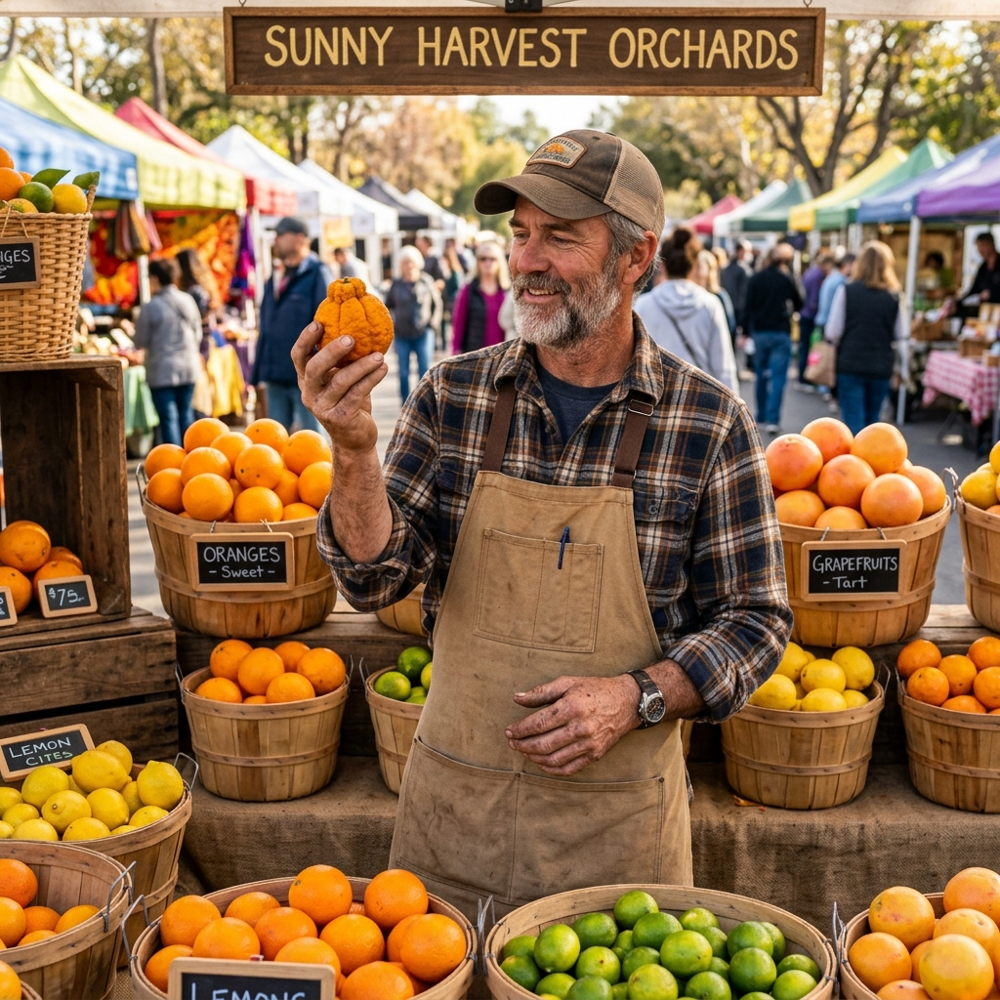
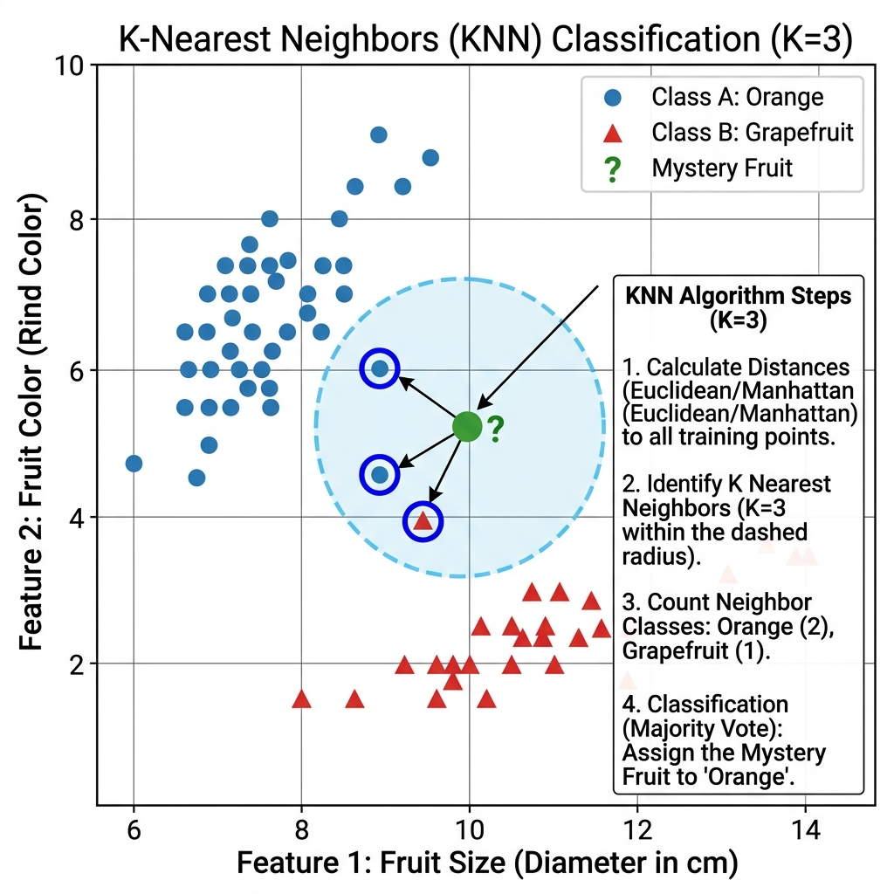

# Chapter 14: K-Nearest Neighbors (KNN)

<p align="center">
  
</p>

## Introduction

K-Nearest Neighbors is one of the simplest yet most powerful algorithms in machine learning. To classify an unknown item, KNN looks at the **K closest known items** and lets them **vote**. The majority wins.

> **Key Insight** (from *Grokking Algorithms*, Ch. 10): "KNN is simple but useful! If you're trying to classify something, you might want to try KNN first. You can use KNN for classification (grouping into a category) and regression (predicting a number)."

### When to Use KNN

- **Classification** — is this email spam or not spam?
- **Regression** — what rating would this user give this movie?
- **Recommendation systems** — find users with similar tastes
- **Pattern recognition** — OCR, image classification
- **Anomaly detection** — identify outliers based on distance from neighbors

### Real-World Applications

- **Netflix recommendations** — finding users with similar viewing habits
- **Medical diagnosis** — classifying tumors based on similar cases
- **Handwriting recognition** — OCR by comparing to known character shapes
- **Real estate pricing** — estimating house prices from similar nearby properties
- **Credit scoring** — assessing risk based on similar customer profiles

---

## How It Works

1. **Choose K** — the number of neighbors to consider (e.g., K=3)
2. **Calculate distance** from the unknown point to all known points
3. **Sort** by distance and pick the **K nearest** neighbors
4. **For classification**: take a **majority vote** among the K neighbors
5. **For regression**: take the **average** of the K neighbors' values

### Distance Metrics

- **Euclidean distance**: √((x₁-x₂)² + (y₁-y₂)²) — straight-line distance
- **Manhattan distance**: |x₁-x₂| + |y₁-y₂| — city-block distance
- **Cosine similarity**: measures angle between vectors — good for text

### Step-by-Step Visual Walkthrough

<p align="center">
  
</p>

### Worked Example

Classifying a mystery fruit with features: size=8, redness=6.

Known fruits:

| Fruit | Size | Redness | Class |
|-------|------|---------|-------|
| A | 7 | 7 | Orange |
| B | 7 | 4 | Grapefruit |
| C | 3 | 4 | Grapefruit |
| D | 9 | 7 | Orange |
| E | 10 | 5 | Grapefruit |

Distances from mystery fruit (8, 6):

| Fruit | Distance | Class |
|-------|----------|-------|
| A | √((8-7)²+(6-7)²) = √2 ≈ **1.41** | Orange |
| D | √((8-9)²+(6-7)²) = √2 ≈ **1.41** | Orange |
| B | √((8-7)²+(6-4)²) = √5 ≈ **2.24** | Grapefruit |
| E | √((8-10)²+(6-5)²) = √5 ≈ **2.24** | Grapefruit |
| C | √((8-3)²+(6-4)²) = √29 ≈ 5.39 | Grapefruit |

With **K=3**: 2 Oranges, 1 Grapefruit → ✅ **Classified as Orange!**

---

## Complexity Analysis

| Metric | Complexity | Explanation |
|--------|-----------|-------------|
| **Training** | O(1) | No training — "lazy learning" |
| **Prediction** | O(n × d) | Compare to all n points in d dimensions |
| **Space** | O(n × d) | Store all training data |

> **From *Grokking Algorithms* Ch. 10:** "Feature extraction means converting an item into a list of numbers that can be compared. Picking good features is an important part of a successful KNN algorithm."

### Choosing K

- **K too small** (e.g., K=1) → sensitive to noise and outliers
- **K too large** (e.g., K=n) → everything classified as the majority class
- **Rule of thumb**: K = √n (square root of sample size), always use an **odd K** to avoid ties

---

## Implementations

### Java

```java
import java.util.*;

public class KNN {

    record Point(double[] features, String label) {}

    /**
     * Euclidean distance between two feature vectors.
     */
    public static double distance(double[] a, double[] b) {
        double sum = 0;
        for (int i = 0; i < a.length; i++) {
            sum += Math.pow(a[i] - b[i], 2);
        }
        return Math.sqrt(sum);
    }

    /**
     * KNN classification.
     * @param data    training data points
     * @param query   the point to classify
     * @param k       number of neighbors
     * @return predicted class label
     */
    public static String classify(List<Point> data, double[] query, int k) {
        // Calculate distances and sort
        List<Map.Entry<Double, String>> distances = new ArrayList<>();
        for (Point p : data) {
            distances.add(Map.entry(distance(p.features, query), p.label));
        }
        distances.sort(Map.Entry.comparingByKey());

        // Count votes from K nearest neighbors
        Map<String, Integer> votes = new HashMap<>();
        for (int i = 0; i < k; i++) {
            String label = distances.get(i).getValue();
            votes.merge(label, 1, Integer::sum);
        }

        return Collections.max(votes.entrySet(), Map.Entry.comparingByValue()).getKey();
    }

    /**
     * KNN regression — predicts a numeric value.
     */
    public static double regress(List<Point> data, double[] query,
                                  double[] values, int k) {
        List<Map.Entry<Double, Integer>> distances = new ArrayList<>();
        for (int i = 0; i < data.size(); i++) {
            distances.add(Map.entry(distance(data.get(i).features, query), i));
        }
        distances.sort(Map.Entry.comparingByKey());

        double sum = 0;
        for (int i = 0; i < k; i++) {
            sum += values[distances.get(i).getValue()];
        }
        return sum / k;
    }

    public static void main(String[] args) {
        List<Point> fruits = List.of(
            new Point(new double[]{7, 7}, "Orange"),
            new Point(new double[]{7, 4}, "Grapefruit"),
            new Point(new double[]{3, 4}, "Grapefruit"),
            new Point(new double[]{9, 7}, "Orange"),
            new Point(new double[]{10, 5}, "Grapefruit")
        );

        double[] mystery = {8, 6};
        String result = classify(fruits, mystery, 3);
        System.out.println("Mystery fruit classified as: " + result);
    }
}
```

### Python

```python
import math
from collections import Counter


def euclidean_distance(a: list[float], b: list[float]) -> float:
    """Calculate Euclidean distance between two points."""
    return math.sqrt(sum((x - y) ** 2 for x, y in zip(a, b)))


def knn_classify(data: list[tuple[list[float], str]],
                 query: list[float], k: int = 3) -> str:
    """
    KNN classification.
    Returns the majority class among the k nearest neighbors.
    """
    # Calculate distances
    distances = [
        (euclidean_distance(features, query), label)
        for features, label in data
    ]
    distances.sort(key=lambda x: x[0])

    # Majority vote among K nearest
    k_nearest = [label for _, label in distances[:k]]
    return Counter(k_nearest).most_common(1)[0][0]


def knn_regress(data: list[tuple[list[float], float]],
                query: list[float], k: int = 3) -> float:
    """
    KNN regression.
    Returns the average value of the k nearest neighbors.
    """
    distances = [
        (euclidean_distance(features, query), value)
        for features, value in data
    ]
    distances.sort(key=lambda x: x[0])

    return sum(value for _, value in distances[:k]) / k


if __name__ == "__main__":
    # Classification: fruit type
    fruits = [
        ([7, 7], "Orange"),
        ([7, 4], "Grapefruit"),
        ([3, 4], "Grapefruit"),
        ([9, 7], "Orange"),
        ([10, 5], "Grapefruit"),
    ]

    mystery = [8, 6]
    result = knn_classify(fruits, mystery, k=3)
    print(f"Mystery fruit (size=8, redness=6): {result}")

    # Regression: predict bread price
    bakeries = [
        ([1, 5], 300_000),  # (features: location rating, size) → price
        ([2, 3], 250_000),
        ([4, 5], 350_000),
        ([3, 4], 280_000),
    ]
    predicted = knn_regress(bakeries, [3, 5], k=2)
    print(f"Predicted value: ${predicted:,.0f}")
```

### C++

```cpp
#include <iostream>
#include <vector>
#include <cmath>
#include <algorithm>
#include <map>
#include <string>

struct Point {
    std::vector<double> features;
    std::string label;
};

double euclideanDistance(const std::vector<double>& a,
                        const std::vector<double>& b) {
    double sum = 0;
    for (size_t i = 0; i < a.size(); i++) {
        sum += std::pow(a[i] - b[i], 2);
    }
    return std::sqrt(sum);
}

/**
 * KNN classification.
 * Returns the majority class among the k nearest neighbors.
 */
std::string knnClassify(const std::vector<Point>& data,
                        const std::vector<double>& query, int k) {
    // Calculate distances
    std::vector<std::pair<double, std::string>> distances;
    for (const auto& point : data) {
        distances.emplace_back(
            euclideanDistance(point.features, query), point.label);
    }
    std::sort(distances.begin(), distances.end());

    // Count votes
    std::map<std::string, int> votes;
    for (int i = 0; i < k; i++) {
        votes[distances[i].second]++;
    }

    return std::max_element(votes.begin(), votes.end(),
        [](const auto& a, const auto& b) {
            return a.second < b.second;
        })->first;
}

int main() {
    std::vector<Point> fruits = {
        {{7, 7}, "Orange"},
        {{7, 4}, "Grapefruit"},
        {{3, 4}, "Grapefruit"},
        {{9, 7}, "Orange"},
        {{10, 5}, "Grapefruit"}
    };

    std::vector<double> mystery = {8, 6};
    std::string result = knnClassify(fruits, mystery, 3);
    std::cout << "Mystery fruit: " << result << std::endl;

    return 0;
}
```

---

## Key Takeaways

1. **No training phase** — KNN is a "lazy learner" that stores all data
2. **Feature extraction is critical** — choose features that truly differentiate classes
3. **Distance metric matters** — Euclidean for continuous, cosine for text
4. **Choosing K is key** — too small = noisy, too large = overly general
5. **Two modes** — classification (majority vote) and regression (average)

> **Sources**: *Grokking Algorithms* Ch. 10, *Introduction to Algorithms* (CLRS), *Cracking the Coding Interview*

---

| [← Topological Sort](13-topological-sort.md) | [Next: A* Search →](15-a-star-search.md) |
|:----------------------------------------------|------------------------------------------:|
