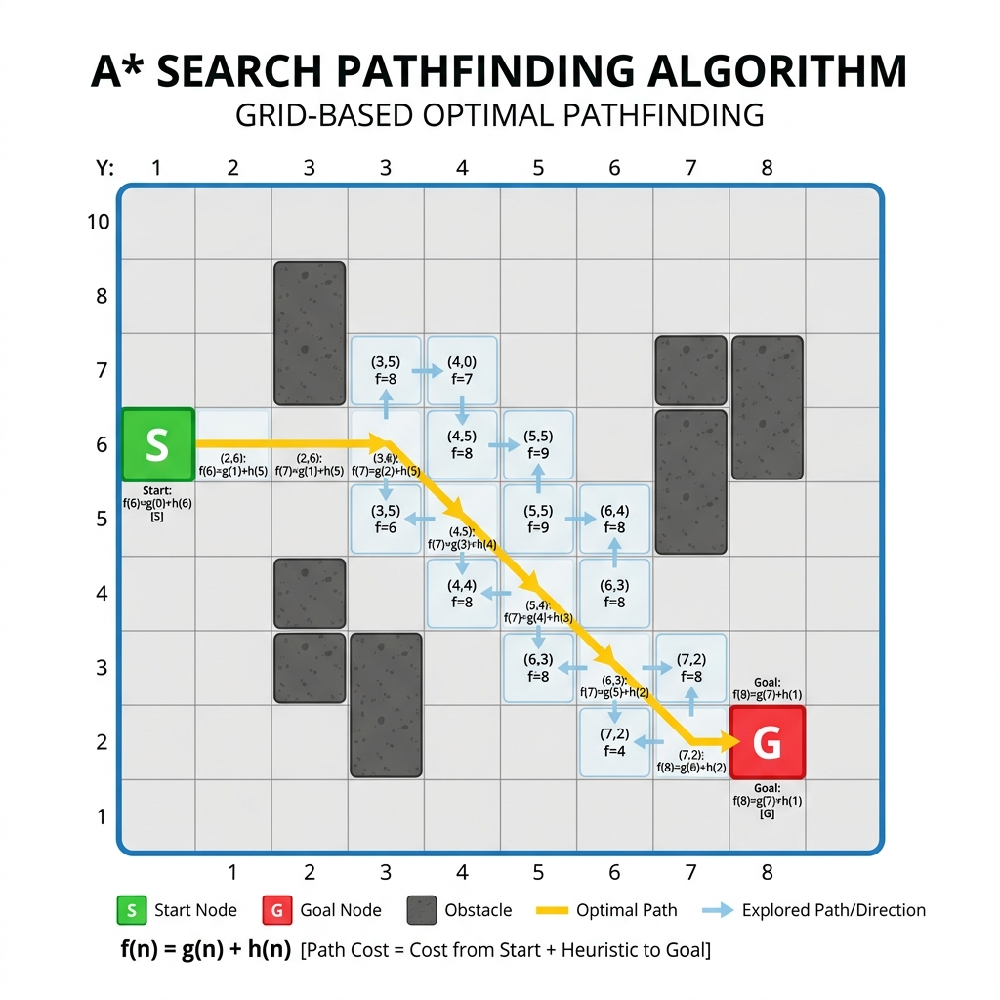

# Chapter 15: A* Search Algorithm

<p align="center">
  
</p>

## Introduction

A* (pronounced "A-star") is the gold standard for **informed graph search** and **pathfinding**. It combines the completeness of Dijkstra's algorithm with a **heuristic function** that guides the search toward the goal, making it dramatically faster in practice.

> **Key Insight** (from *Advanced Algorithms and Data Structures*): "A* combines the best of both worlds: it uses the actual cost from the start (like Dijkstra) plus an estimated cost to the goal (heuristic) to prioritize which nodes to explore next."

### When to Use A*

- **Shortest path** with a good heuristic available
- **Game AI pathfinding** — navigating characters around obstacles
- **GPS navigation** — finding optimal driving routes
- **Robotics** — motion planning for autonomous vehicles
- **Puzzle solving** — sliding puzzles, Rubik's cube

### Real-World Applications

- **Google Maps / Waze** — route planning with estimated travel time
- **Video games** — NPC pathfinding (Warcraft, StarCraft, etc.)
- **Autonomous vehicles** — obstacle avoidance and route planning
- **Network routing** — finding optimal packet paths
- **AI planning** — state-space search in problem solving

---

## How It Works

A* evaluates nodes using the function **f(n) = g(n) + h(n)**:

- **g(n)** = actual cost from the start to node n
- **h(n)** = estimated cost from node n to the goal (heuristic)
- **f(n)** = total estimated cost of the cheapest path through n

### Algorithm Steps

1. Add the **start node** to an open set (priority queue sorted by f)
2. While the open set is not empty:
   - **Remove** the node with the lowest f(n)
   - If it's the **goal** → reconstruct and return the path
   - For each **neighbor**: calculate tentative g, update if better
   - Add/update the neighbor in the open set
3. If open set empties → **no path exists**

### Heuristic Requirements

- **Admissible**: h(n) must **never overestimate** the true cost → guarantees optimality
- **Consistent** (monotone): h(n) ≤ cost(n, n') + h(n') → guarantees efficiency

Common heuristics:
- **Manhattan distance**: |x₁-x₂| + |y₁-y₂| (grid movement, no diagonals)
- **Euclidean distance**: √((x₁-x₂)² + (y₁-y₂)²) (free movement)
- **Diagonal distance**: max(|Δx|, |Δy|) (grid with diagonal movement)

### Step-by-Step Visual Walkthrough

<p align="center">
  
</p>

### Worked Example

Finding shortest path on a 5×5 grid from (0,0) to (4,4) with obstacles:

```
S . . . .
. # # . .
. . . . .
. . # # .
. . . . G
```

Using Manhattan distance heuristic:

| Step | Current | g(n) | h(n) | f(n) | Action |
|------|---------|------|------|------|--------|
| 1 | (0,0) | 0 | 8 | 8 | Start — expand neighbors |
| 2 | (1,0) | 1 | 7 | 8 | Move down |
| 3 | (0,1) | 1 | 7 | 8 | Move right |
| 4 | (2,1) | 3 | 5 | 8 | Continue toward goal |
| ... | ... | ... | ... | ... | ... |
| N | (4,4) | 8 | 0 | 8 | ✅ **Goal reached! Path cost: 8** |

A* explores far **fewer nodes** than Dijkstra by using the heuristic to avoid dead ends.

---

## Mathematical Foundation

A* search mathematically guarantees finding the shortest path (if one exists) by relying on an evaluation function $f(n)$:
$$ f(n) = g(n) + h(n) $$
Where:
- $g(n)$ is the exact cost from the starting node to node $n$.
- $h(n)$ is the estimated (heuristic) cost from node $n$ to the goal.

For A* to guarantee optimality, the heuristic function $h(n)$ must exhibit specific mathematical properties:

**1. Admissibility:**
A heuristic is admissible if it never overestimates the true cost. Let $h^*(n)$ be the true shortest path cost from $n$ to the goal.
$$ \forall n, \quad 0 \le h(n) \le h^*(n) $$
If $h(n)$ is admissible, A* will always find the optimal path.

**2. Consistency (Monotonicity):**
A stronger condition than admissibility. A heuristic is consistent if, for every node $n$ and every successor $p$ of $n$ generated by an action of cost $c(n, p)$, the estimated cost of reaching the goal from $n$ is no greater than the step cost to $p$ plus the estimated cost from $p$:
$$ h(n) \le c(n, p) + h(p) $$
If $h(n)$ is consistent, then the values of $f(n)$ along any path are non-decreasing ($f(p) \ge f(n)$). This guarantees that once a node is expanded, A* has found the optimal path to it, meaning no node ever needs to be re-expanded.

---

## Complexity Analysis

| Metric | Complexity | Explanation |
|--------|-----------|-------------|
| **Time** | O(b^d) worst case | b = branching factor, d = depth of solution |
| **Time** | O(E log V) with good heuristic | Similar to Dijkstra when h is consistent |
| **Space** | O(V) | Stores all explored nodes |

> **A* vs Dijkstra**: Dijkstra explores in all directions equally (h=0). A* focuses the search toward the goal, exploring significantly fewer nodes. With a perfect heuristic h(n) = actual cost, A* finds the path immediately.

### Comparison with Related Algorithms

| Algorithm | Informed? | Optimal? | Complete? | Notes |
|-----------|-----------|----------|-----------|-------|
| **A*** | ✅ Yes | ✅ Yes (if h admissible) | ✅ Yes | Best of both worlds |
| Dijkstra | ❌ No | ✅ Yes | ✅ Yes | A* with h(n) = 0 |
| BFS | ❌ No | ✅ (unweighted) | ✅ Yes | Uniform cost |
| Greedy Best-First | ✅ Yes | ❌ No | ❌ No | Uses only h(n) |

---

## Implementations

### Java

```java
import java.util.*;

public class AStarSearch {

    record Node(int x, int y) {}

    /**
     * A* pathfinding on a 2D grid.
     * @param grid    2D array where 0 = walkable, 1 = obstacle
     * @param start   starting position
     * @param goal    target position
     * @return list of nodes forming the shortest path, or empty if none
     */
    public static List<Node> astar(int[][] grid, Node start, Node goal) {
        int rows = grid.length, cols = grid[0].length;
        int[][] dirs = {{0,1}, {0,-1}, {1,0}, {-1,0}};

        // Priority queue sorted by f = g + h
        PriorityQueue<int[]> open = new PriorityQueue<>(
            Comparator.comparingInt(a -> a[2]));
        open.add(new int[]{start.x, start.y, 0});

        Map<String, Integer> gScore = new HashMap<>();
        Map<String, Node> cameFrom = new HashMap<>();
        String startKey = start.x + "," + start.y;
        gScore.put(startKey, 0);

        while (!open.isEmpty()) {
            int[] current = open.poll();
            int cx = current[0], cy = current[1];
            Node currentNode = new Node(cx, cy);

            if (cx == goal.x && cy == goal.y) {
                // Reconstruct path
                List<Node> path = new ArrayList<>();
                Node node = currentNode;
                while (node != null) {
                    path.add(node);
                    node = cameFrom.get(node.x + "," + node.y);
                }
                Collections.reverse(path);
                return path;
            }

            for (int[] dir : dirs) {
                int nx = cx + dir[0], ny = cy + dir[1];
                if (nx < 0 || nx >= rows || ny < 0 || ny >= cols) continue;
                if (grid[nx][ny] == 1) continue;

                String nKey = nx + "," + ny;
                int tentG = gScore.getOrDefault(cx + "," + cy, Integer.MAX_VALUE) + 1;

                if (tentG < gScore.getOrDefault(nKey, Integer.MAX_VALUE)) {
                    gScore.put(nKey, tentG);
                    int h = Math.abs(nx - goal.x) + Math.abs(ny - goal.y);
                    int f = tentG + h;
                    open.add(new int[]{nx, ny, f});
                    cameFrom.put(nKey, currentNode);
                }
            }
        }
        return List.of();  // no path found
    }

    public static void main(String[] args) {
        int[][] grid = {
            {0, 0, 0, 0, 0},
            {0, 1, 1, 0, 0},
            {0, 0, 0, 0, 0},
            {0, 0, 1, 1, 0},
            {0, 0, 0, 0, 0}
        };

        var path = astar(grid, new Node(0, 0), new Node(4, 4));
        System.out.println("Path:");
        for (var node : path) {
            System.out.println("  (" + node.x + ", " + node.y + ")");
        }
    }
}
```

### Python

```python
import heapq


def astar(grid: list[list[int]], start: tuple[int, int],
          goal: tuple[int, int]) -> list[tuple[int, int]]:
    """
    A* pathfinding on a 2D grid.
    grid: 0 = walkable, 1 = obstacle
    Returns the shortest path as a list of (row, col) tuples.
    """
    rows, cols = len(grid), len(grid[0])
    directions = [(0, 1), (0, -1), (1, 0), (-1, 0)]

    def heuristic(a, b):
        """Manhattan distance."""
        return abs(a[0] - b[0]) + abs(a[1] - b[1])

    # Priority queue: (f_score, node)
    open_set = [(heuristic(start, goal), start)]
    came_from = {}
    g_score = {start: 0}

    while open_set:
        _, current = heapq.heappop(open_set)

        if current == goal:
            # Reconstruct path
            path = []
            while current in came_from:
                path.append(current)
                current = came_from[current]
            path.append(start)
            return path[::-1]

        for dx, dy in directions:
            neighbor = (current[0] + dx, current[1] + dy)
            nx, ny = neighbor

            if not (0 <= nx < rows and 0 <= ny < cols):
                continue
            if grid[nx][ny] == 1:
                continue

            tentative_g = g_score[current] + 1

            if tentative_g < g_score.get(neighbor, float("inf")):
                g_score[neighbor] = tentative_g
                f = tentative_g + heuristic(neighbor, goal)
                heapq.heappush(open_set, (f, neighbor))
                came_from[neighbor] = current

    return []  # no path found


if __name__ == "__main__":
    grid = [
        [0, 0, 0, 0, 0],
        [0, 1, 1, 0, 0],
        [0, 0, 0, 0, 0],
        [0, 0, 1, 1, 0],
        [0, 0, 0, 0, 0],
    ]

    path = astar(grid, (0, 0), (4, 4))
    print(f"Path: {path}")
    print(f"Cost: {len(path) - 1} steps")
```

### C++

```cpp
#include <iostream>
#include <vector>
#include <queue>
#include <unordered_map>
#include <cmath>
#include <algorithm>

struct Node {
    int x, y;
    bool operator==(const Node& other) const { return x == other.x && y == other.y; }
};

struct NodeHash {
    size_t operator()(const Node& n) const {
        return std::hash<int>()(n.x) ^ (std::hash<int>()(n.y) << 16);
    }
};

/**
 * A* pathfinding on a 2D grid.
 * grid: 0 = walkable, 1 = obstacle
 */
std::vector<Node> astar(const std::vector<std::vector<int>>& grid,
                        Node start, Node goal) {
    int rows = grid.size(), cols = grid[0].size();
    int dirs[][2] = {{0,1}, {0,-1}, {1,0}, {-1,0}};

    auto heuristic = [](Node a, Node b) {
        return std::abs(a.x - b.x) + std::abs(a.y - b.y);
    };

    // Priority queue: (f_score, node)
    using PQEntry = std::pair<int, Node>;
    std::priority_queue<PQEntry, std::vector<PQEntry>, std::greater<>> open;
    open.push({heuristic(start, goal), start});

    std::unordered_map<Node, int, NodeHash> gScore;
    std::unordered_map<Node, Node, NodeHash> cameFrom;
    gScore[start] = 0;

    while (!open.empty()) {
        auto [f, current] = open.top();
        open.pop();

        if (current == goal) {
            std::vector<Node> path;
            Node node = current;
            while (!(node == start)) {
                path.push_back(node);
                node = cameFrom[node];
            }
            path.push_back(start);
            std::reverse(path.begin(), path.end());
            return path;
        }

        for (auto& dir : dirs) {
            Node neighbor{current.x + dir[0], current.y + dir[1]};

            if (neighbor.x < 0 || neighbor.x >= rows ||
                neighbor.y < 0 || neighbor.y >= cols) continue;
            if (grid[neighbor.x][neighbor.y] == 1) continue;

            int tentG = gScore[current] + 1;

            if (!gScore.count(neighbor) || tentG < gScore[neighbor]) {
                gScore[neighbor] = tentG;
                int fScore = tentG + heuristic(neighbor, goal);
                open.push({fScore, neighbor});
                cameFrom[neighbor] = current;
            }
        }
    }
    return {};  // no path found
}

int main() {
    std::vector<std::vector<int>> grid = {
        {0, 0, 0, 0, 0},
        {0, 1, 1, 0, 0},
        {0, 0, 0, 0, 0},
        {0, 0, 1, 1, 0},
        {0, 0, 0, 0, 0}
    };

    auto path = astar(grid, {0, 0}, {4, 4});
    std::cout << "Path:" << std::endl;
    for (const auto& node : path) {
        std::cout << "  (" << node.x << ", " << node.y << ")" << std::endl;
    }
    std::cout << "Cost: " << path.size() - 1 << " steps" << std::endl;

    return 0;
}
```

---

## Key Takeaways

1. **f(n) = g(n) + h(n)** — the core formula combining actual and estimated cost
2. **Admissible heuristic** — never overestimate → guarantees shortest path
3. **Generalizes Dijkstra** — Dijkstra is A* with h(n) = 0
4. **Dramatically faster** in practice — heuristic prunes irrelevant search directions
5. **Widely used in games and navigation** — the industry standard for pathfinding

> **Sources**: *Advanced Algorithms and Data Structures* (La Rocca), *Introduction to Algorithms* (CLRS) Ch. 24, *The Algorithm Design Manual* (Skiena) Ch. 6

---

| [← K-Nearest Neighbors](14-knn.md) | [Next: Bloom Filters →](16-bloom-filter.md) |
|:-------------------------------------|---------------------------------------:|
