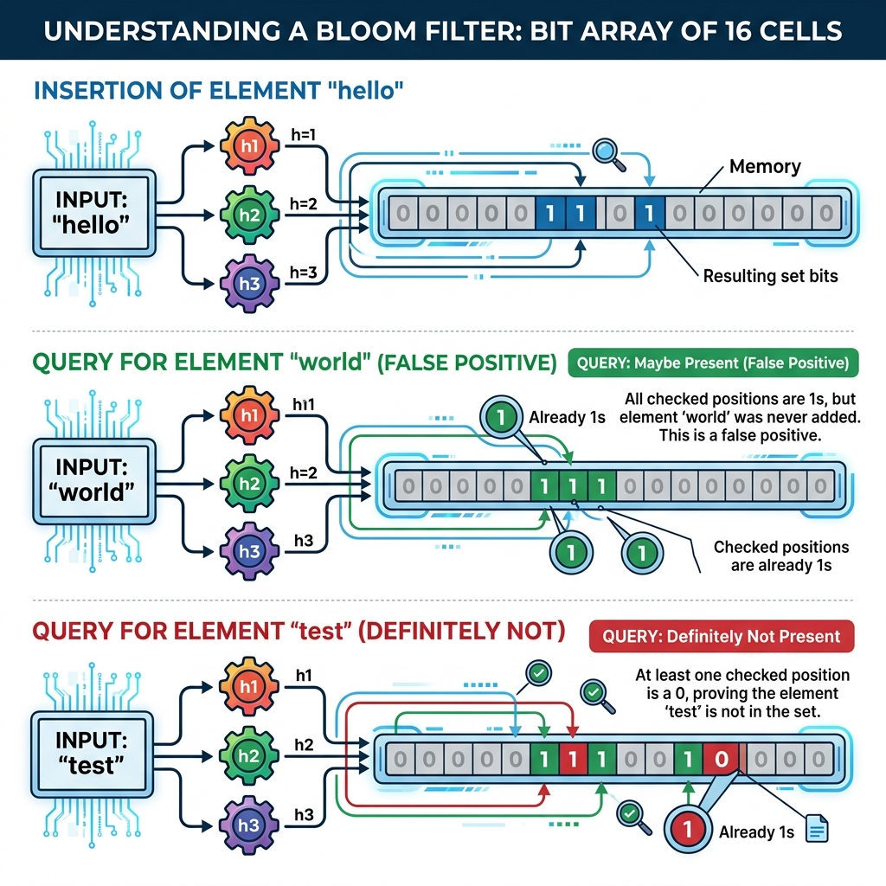

# Chapter 16: Bloom Filters

<p align="center">
  
</p>

## Introduction

A Bloom filter is a highly space-efficient **probabilistic data structure** used to test whether an element is a member of a set. It is famous for a unique property: it can definitively tell you if an element is **not** in the set, but can only probabilistically tell you if an element **might be** in the set.

> **Key Insight** (from *Bloom Filter: A Data Structure for Computer Networking, Big Data, Cloud Computing, Internet of Things, Bioinformatics*): "Bloom Filter is utilized to enhance systems' performance drastically using a tiny amount of main memory. Moreover, it can accommodate a massive amount of data using a small amount of memory... It returns either True or False in a query for an item. A true result can be either a true positive or a false positive."

### When to Use Bloom Filters

- **Pre-filtering expensive lookups** — checking the Bloom filter before making a costly disk or database read
- **Memory-constrained environments** — storing a massive number of elements where a traditional hash set would run out of RAM
- **Streaming data** — tracking seen items in high-throughput streams (Big Data)
- **Networking** — quick lookups for routing tables or blocklists

### Real-World Applications

- **Web browsers (Google Chrome)** — previously used to identify malicious URLs (Safe Browsing)
- **Databases (Cassandra, Bigtable, HBase)** — reducing disk lookups for non-existent rows
- **Network Security** — mitigating Distributed Denial-of-Service (DDoS) attacks by tracking malicious IPs
- **Bioinformatics** — DNA assembly and k-mer counting
- **Content Delivery Networks (CDNs)** — preventing caching of "one-hit wonders" (Summary Cache)

---

## How It Works

A standard Bloom filter consists of two main components:
1. A **bit array** of `m` bits, all initialized to `0`.
2. **`k` different hash functions**, each mapping an input string to one of the `m` array positions.

### Operations

**Insertion:**
1. Feed the input element to all `k` hash functions.
2. Get `k` array indices.
3. Set the bits at all these `k` indices to `1`.

**Querying (Membership Check):**
1. Feed the input element to the same `k` hash functions.
2. Check the bits at the resulting `k` indices.
3. If **any** of the bits is `0`, the element is **definitely not** in the set.
4. If **all** of the bits are `1`, the element is **probably** in the set (it might be a false positive caused by overlapping bits from other inserted elements).

**Deletion:**
- Not supported in a standard Bloom filter (setting a `1` to `0` might accidentally remove other elements). Counting Bloom filters solve this by using integer counters instead of bits.

### Step-by-Step Visual Walkthrough

<p align="center">
  
</p>

### Worked Example

Let's use a bit array of size `m = 10` and `k = 2` hash functions ($h_1$ and $h_2$).

**Bit Array Initialization:**
`[0, 0, 0, 0, 0, 0, 0, 0, 0, 0]`

**Step 1: Insert "apple"**
- $h_1(\text{"apple"}) = 2$
- $h_2(\text{"apple"}) = 7$
- Set bits 2 and 7 to 1.
- Array: `[0, 0, 1, 0, 0, 0, 0, 1, 0, 0]`

**Step 2: Insert "banana"**
- $h_1(\text{"banana"}) = 7$
- $h_2(\text{"banana"}) = 9$
- Set bits 7 and 9 to 1. (Bit 7 is already 1, keep it 1).
- Array: `[0, 0, 1, 0, 0, 0, 0, 1, 0, 1]`

**Step 3: Query "apple"**
- $h_1(\text{"apple"}) = 2 \rightarrow$ Bit is 1
- $h_2(\text{"apple"}) = 7 \rightarrow$ Bit is 1
- Result: **Probably Present**

**Step 4: Query "grape"**
- $h_1(\text{"grape"}) = 4 \rightarrow$ Bit is 0
- $h_2(\text{"grape"}) = 7 \rightarrow$ Bit is 1
- Result: **Definitely Not Present** (Because bit 4 is 0)

**Step 5: Query "orange" (False Positive)**
- Let's say $h_1(\text{"orange"}) = 2$ and $h_2(\text{"orange"}) = 9$.
- Both bits 2 and 9 are 1 (set by "apple" and "banana").
- Result: **Probably Present** (Even though we never inserted "orange"!)

---

## Complexity Analysis

| Metric | Complexity | Explanation |
|--------|-----------|-------------|
| **Insertion Time** | O(k) | Hash the element $k$ times and set $k$ bits. Independent of the number of elements in the filter. |
| **Query Time** | O(k) | Hash the element $k$ times and read $k$ bits. |
| **Space** | O(m) | Requires a fixed-size array of $m$ bits. Significantly smaller than storing actual elements. |

### False Positive Probability and Optimal Parameters

The false positive rate ($p$) depends on the array size ($m$), the number of inserted elements ($n$), and the number of hash functions ($k$).

To minimize false positives for a given $m$ and $n$, the optimal number of hash functions is:
$$k = \frac{m}{n} \ln 2 \approx 0.693 \frac{m}{n}$$

To achieve a desired false positive probability $p$ for $n$ elements, the required size of the bit array is:
$$m = -\frac{n \ln p}{(\ln 2)^2}$$

> **Note**: Fast, non-cryptographic hash functions like **MurmurHash** are heavily recommended to maintain high throughput in Bloom filters.

---

## Implementations

### Java

```java
import java.util.BitSet;
import java.nio.charset.StandardCharsets;
import java.security.MessageDigest;
import java.security.NoSuchAlgorithmException;

public class BloomFilter {
    private BitSet bitSet;
    private int bitArraySize;
    private int numHashFunctions;
    private MessageDigest md;

    /**
     * Constructs a Bloom filter.
     * @param expectedElements The expected number of insertions.
     * @param falsePositiveRate The desired false positive probability (e.g., 0.01 for 1%).
     */
    public BloomFilter(int expectedElements, double falsePositiveRate) {
        // Calculate optimal bit array size
        this.bitArraySize = (int) Math.ceil(
            -1 * (expectedElements * Math.log(falsePositiveRate)) / Math.pow(Math.log(2), 2)
        );
        // Calculate optimal number of hash functions
        this.numHashFunctions = (int) Math.round(
            (this.bitArraySize / (double) expectedElements) * Math.log(2)
        );
        this.bitSet = new BitSet(this.bitArraySize);

        try {
            // Using MD5 for demonstration. In production, use MurmurHash3.
            this.md = MessageDigest.getInstance("MD5");
        } catch (NoSuchAlgorithmException e) {
            throw new RuntimeException(e);
        }
    }

    /**
     * Generates a hash value for the given string and hash function index.
     */
    private int getHash(String value, int i) {
        md.reset();
        md.update(value.getBytes(StandardCharsets.UTF_8));
        md.update((byte) i); // Salt with the index to simulate k different functions
        byte[] digest = md.digest();
        // Convert first 4 bytes to int
        int hash = ((digest[0] & 0xFF) << 24) |
                   ((digest[1] & 0xFF) << 16) |
                   ((digest[2] & 0xFF) << 8)  |
                   (digest[3] & 0xFF);
        return Math.abs(hash) % bitArraySize;
    }

    public void add(String value) {
        for (int i = 0; i < numHashFunctions; i++) {
            bitSet.set(getHash(value, i));
        }
    }

    public boolean mightContain(String value) {
        for (int i = 0; i < numHashFunctions; i++) {
            if (!bitSet.get(getHash(value, i))) {
                return false; // Definitely not present
            }
        }
        return true; // Probably present
    }

    public static void main(String[] args) {
        BloomFilter filter = new BloomFilter(100, 0.05);

        filter.add("hello");
        filter.add("world");

        System.out.println("Contains 'hello'? " + filter.mightContain("hello")); // true
        System.out.println("Contains 'world'? " + filter.mightContain("world")); // true
        System.out.println("Contains 'test'?  " + filter.mightContain("test"));  // false (most likely)
    }
}
```

### Python

```python
import math
import hashlib

class BloomFilter:
    def __init__(self, expected_elements: int, false_positive_rate: float):
        """
        Initializes the Bloom filter with optimal size and hash count.
        """
        # Calculate optimal array size (m)
        self.bit_array_size = math.ceil(
            -(expected_elements * math.log(false_positive_rate)) / (math.log(2) ** 2)
        )
        # Calculate optimal number of hash functions (k)
        self.num_hash_functions = round(
            (self.bit_array_size / expected_elements) * math.log(2)
        )
        # Initialize bit array
        self.bit_array = [0] * self.bit_array_size

    def _hash(self, item: str, i: int) -> int:
        """
        Generates the i-th hash for the item.
        Uses MD5 for simplicity, salting it with the index i.
        """
        hasher = hashlib.md5()
        hasher.update(item.encode('utf-8'))
        hasher.update(str(i).encode('utf-8'))
        return int(hasher.hexdigest(), 16) % self.bit_array_size

    def add(self, item: str) -> None:
        """Adds an item to the Bloom filter."""
        for i in range(self.num_hash_functions):
            index = self._hash(item, i)
            self.bit_array[index] = 1

    def might_contain(self, item: str) -> bool:
        """
        Checks if the item might be in the filter.
        Returns False if definitely not present.
        Returns True if probably present.
        """
        for i in range(self.num_hash_functions):
            index = self._hash(item, i)
            if self.bit_array[index] == 0:
                return False
        return True


if __name__ == "__main__":
    filter = BloomFilter(expected_elements=100, false_positive_rate=0.05)

    filter.add("apple")
    filter.add("banana")

    print(f"Contains 'apple'?  {filter.might_contain('apple')}")  # True
    print(f"Contains 'banana'? {filter.might_contain('banana')}") # True
    print(f"Contains 'grape'?  {filter.might_contain('grape')}")  # False (probably)
```

### C++

```cpp
#include <iostream>
#include <vector>
#include <cmath>
#include <string>
#include <functional>

class BloomFilter {
private:
    std::vector<bool> bitArray;
    int bitArraySize;
    int numHashFunctions;

    // Simple hash function using std::hash combined with a seed
    int getHash(const std::string& item, int i) const {
        std::hash<std::string> hasher;
        // Combine the item and the index to simulate k hash functions
        size_t hash = hasher(item + std::to_string(i));
        return hash % bitArraySize;
    }

public:
    BloomFilter(int expectedElements, double falsePositiveRate) {
        bitArraySize = std::ceil(
            -(expectedElements * std::log(falsePositiveRate)) / std::pow(std::log(2), 2)
        );
        numHashFunctions = std::round(
            (static_cast<double>(bitArraySize) / expectedElements) * std::log(2)
        );
        bitArray.resize(bitArraySize, false);
    }

    void add(const std::string& item) {
        for (int i = 0; i < numHashFunctions; i++) {
            bitArray[getHash(item, i)] = true;
        }
    }

    bool mightContain(const std::string& item) const {
        for (int i = 0; i < numHashFunctions; i++) {
            if (!bitArray[getHash(item, i)]) {
                return false; // Definitely not present
            }
        }
        return true; // Probably present
    }
};

int main() {
    BloomFilter filter(100, 0.05);

    filter.add("cat");
    filter.add("dog");

    std::cout << std::boolalpha;
    std::cout << "Contains 'cat'? " << filter.mightContain("cat") << std::endl;  // true
    std::cout << "Contains 'dog'? " << filter.mightContain("dog") << std::endl;  // true
    std::cout << "Contains 'bird'? " << filter.mightContain("bird") << std::endl; // false

    return 0;
}
```

---

## Key Takeaways

1. **Space Over Accuracy** — Bloom filters trade deterministic accuracy for massive space savings.
2. **No False Negatives** — If it says "No", it is 100% correct.
3. **False Positives Exist** — If it says "Yes", it might be wrong.
4. **No Deletions** — Standard Bloom filters cannot delete items. Using a Counting Bloom Filter solves this.
5. **Math Matters** — The array size `m` and hash count `k` must be carefully tuned to the expected data volume to maintain an acceptable false positive rate.

> **Sources**: *Bloom Filter: A Data Structure for Computer Networking, Big Data, Cloud Computing, Internet of Things, Bioinformatics* by Ripon Patgiri, Sabuzima Nayak, et al.

---

| [← A* Search](15-a-star-search.md) | [Table of Contents →](../README.md) |
|:------------------------------------|-------------------------------------:|
